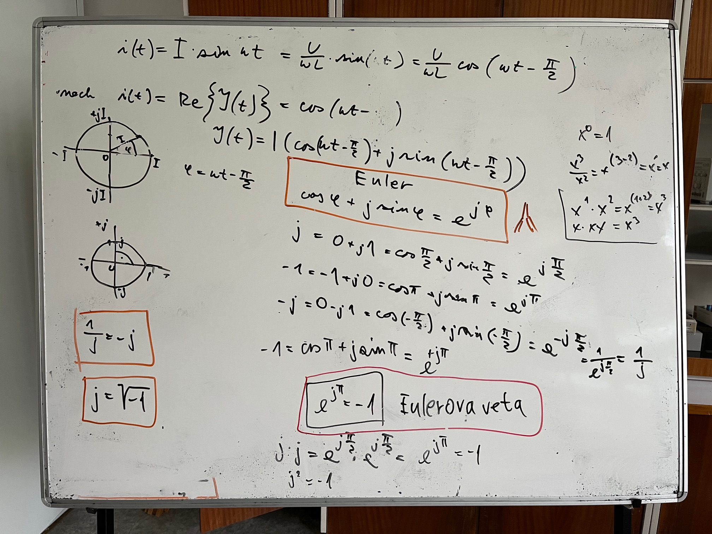

## Goniometrické funkcie

### Uhol v radiánoch a v stupňoch

### Goniometrické vzorce

## Harmonický signál

### Čo je signál?

### Perióda, frekvencia, uhlová rýchosť

## Komplexná algebra
###  Eulerova veta
{ width="650"}

## Fázový vektor = Fázor
###  Fázor napätia a prúdu
###  Impedancia, admitancia, prenos
