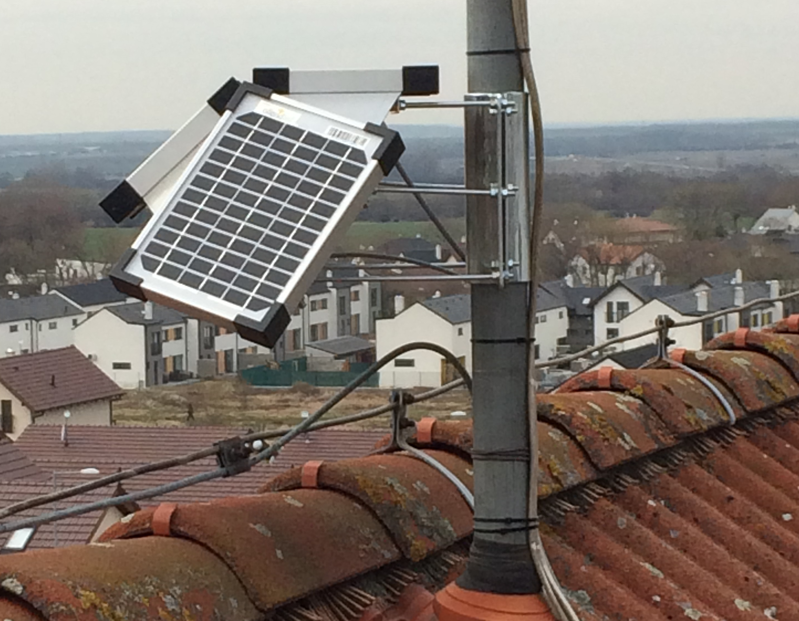
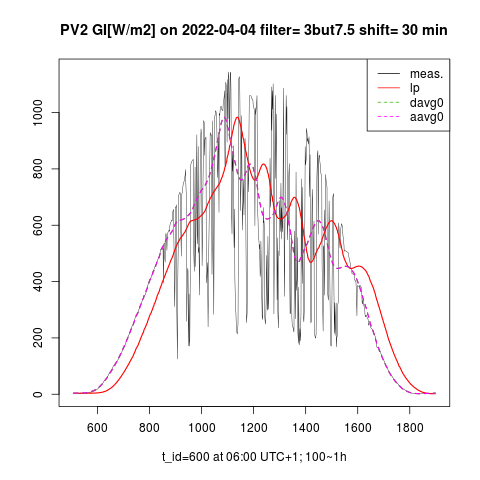

{.float-left width="70" height="100"}
&nbsp;&nbsp;&nbsp;&nbsp;&nbsp;&nbsp; Hello! My name is Milan Hronský  
&nbsp;&nbsp;&nbsp;&nbsp;&nbsp;&nbsp; I am an electrical engineer researching the propagation  
&nbsp;&nbsp;&nbsp;&nbsp;&nbsp;&nbsp; of stochastic signals through linear systems. Working  
&nbsp;&nbsp;&nbsp;&nbsp;&nbsp;&nbsp; towards better integration of renewable energy in the grid.  

A common problem of renewable energy is its [intermittency](https://mhrons.github.io/pv_intermit/).
The share of fossile and nuclear energy in the grid will remain high, unless the renewable power is stable. My goal is to smooth the time course of renewable power on a low aggregation level by lossless and affordable means.  
I have developed a new filter of intermittent power, accumulating a minimum of energy. My smoothing method [SPLPF](https://mhrons.github.io/splpf/) is highly effective with low [Wh] capacity energy storage systems (ESS) providing high relative power [W/Wh] like e.g. flywheel (FESS) or supercapacitor (EDLC).  
I have a pending patent app. No. PCT/SK2022/050014 in the smoothing of renewable power. The European Patent Office has recently issued an International Search Report confirming its novelty, inventive step, and industrial applicability.  
I am currently searching an industrial & funding partner who might benefit from my technology.

My photovoltaic projects:

- [PV Logger](https://mhrons.github.io/pv_log/) &nbsp;&nbsp;&nbsp;&nbsp;&nbsp;&nbsp;&nbsp;&nbsp;&nbsp;&nbsp;&nbsp;&nbsp;&nbsp;&nbsp;&nbsp;&nbsp;&nbsp;&nbsp;&nbsp;&nbsp;&nbsp;&nbsp;&nbsp;&nbsp;&nbsp;&nbsp;&nbsp;&nbsp;&nbsp; {width="120"}  
  
- [Smoothing renewable power](https://mhrons.github.io/pv_smooth/) {width="120"}

You can reach me out at [LinkedIn](https://www.linkedin.com/in/milan-hronsky-76132224/) or [email](mailto:milan.hronsky@gmail.com) me.  
© Milan Hronský 2024
