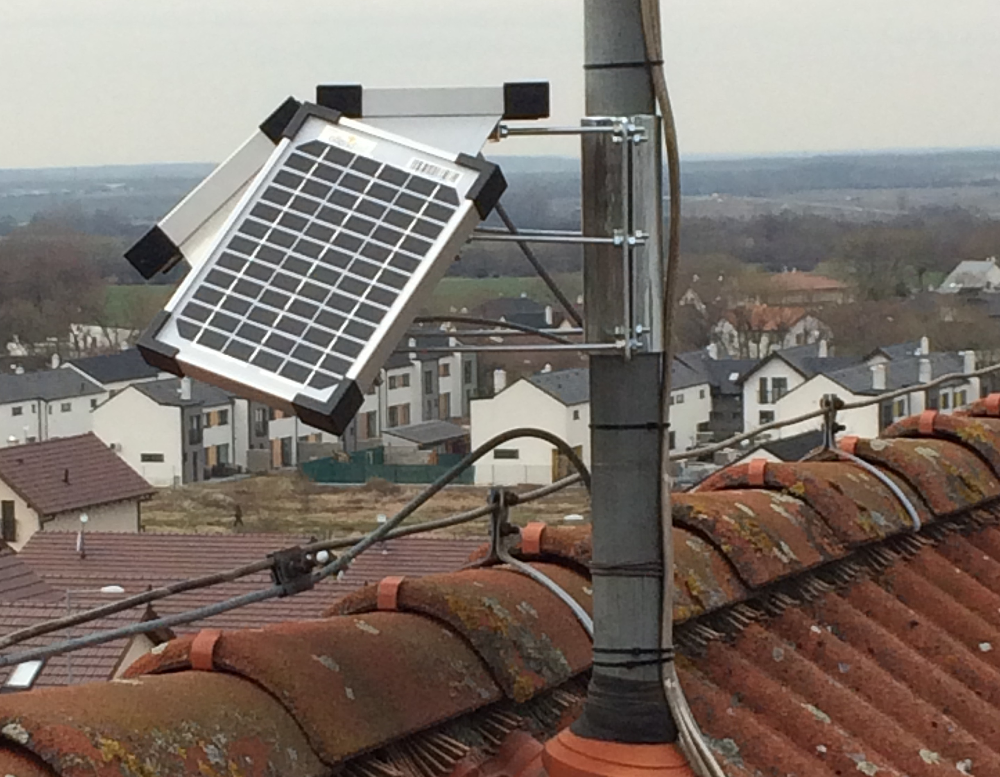

{ align=left width="90" height="120"}
&nbsp;&nbsp; Hello! My name is Milan Hronský  
&nbsp;&nbsp; I research the propagation of stochastic signals in linear systems. My research  
&nbsp;&nbsp; aims to better integrate the renewable energy into the grid.  
&nbsp;&nbsp; I am also a teacher at the Secondary Technical School of **E**lectrical **E**ngineering  
&nbsp;&nbsp; in Slovakia. For the sake of education, my textbook "**EE** pre SŠ" is written   
&nbsp;&nbsp; in Slovak. Here I aim to provide a comprehensive but exact explanation of the theory of electrical engineering to students of secondary schools.

A common problem of renewable power is its [intermittency](https://mhrons.github.io/pv_intermit/).
The share of fossile and nuclear energy in the grid will remain high, unless the renewable power is stable over time. The first stage of its stabilizing is [smoothing the renewable power](https://mhrons.github.io/pv_smooth/) on a low aggregation level.  
A lossless filter of intermittent power, accumulating a minimum of energy, is discussed here in theory and practise. Its energy storage system (ESS) has been mimized in terms of energy capacity, and it can provide [synthetic inertia](https://mhrons.github.io/pv_intermit/#smoothing-synthetic-inertia) to the grid on days with low solar/wind intermittency, as a by-product.  
The novel smoothing method [SPLPF](https://mhrons.github.io/splpf/) is highly effective with low [Wh] capacity ESS providing high relative power [W/Wh] like e.g. flywheel (FESS) or supercapacitor (EDLC). Having a pending patent app. No. PCT/SK2022/050014 in the smoothing of renewable power, I am searching an industrial & funding partner who might benefit from this technology.

My RES projects:

{ align=left width="120"}  
[PV Logger](https://mhrons.github.io/pv_log/)  
   
 
{ align=left width="120"}  
[Smoothing Renewable Power](https://mhrons.github.io/pv_smooth/)  
   
   
You can contact me at [LinkedIn](https://www.linkedin.com/in/milan-hronsky-76132224/) or [email](mailto:milan.hronsky@gmail.com)  
© Milan Hronský 2026  
[https://mhrons.com](https://mhrons.com)
