## List of Diagrams
Diagrams express the smoothing effect and accumulated energy depending on the smoothing method, prediction accuracy, and filter order (OLAP dimensions). Two days have been selected from the measured data (a day with medium vs. a day with high insolation, both of them with strong solar intermittency). Following time series are displayed:

- Measured GI(t), synchronized with predicted GI~f~ (1 hour zoomed) - Figures 4, 8
- Measured GI(t) and its smooth counterpart by the prediction accuracy, comparing all smoothing methods, having optimal LPF order applied - Figures 5, 6, 9, 10
- Accumulated GX(t) by the prediction accuracy, comparing all smoothing methods, having optimal LPF order applied - Figures 7, 11
- Smooth GI(t) by the filter order and prediction accuracy, comparing IPLPF and SPLPF smoothing methods - Figures 12-14, 18-20
- Accumulated GX(t) by the filter order and prediction accuracy, comparing IPLPF and SPLPF smoothing methods - Figures 15-17, 21-23

##  Analysis by prediction error

###  A day with medium insolation

<figure markdown>
  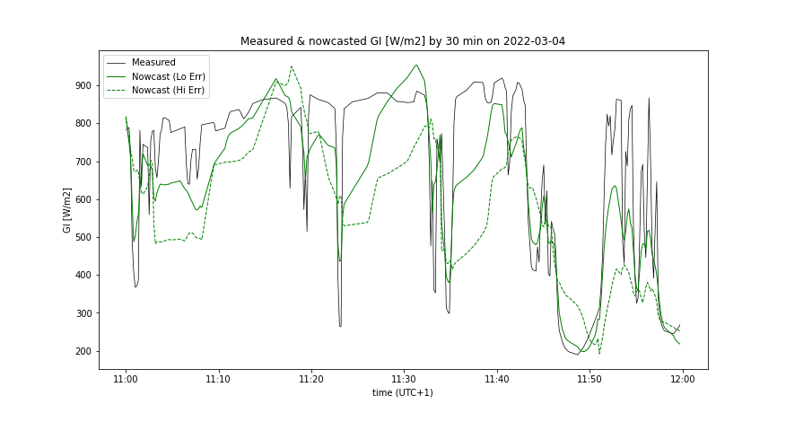{ width="650"}
  <figcaption>Figure 4: Measured GI synchronized with GIf (predicted 30 minutes ago) between 11:00 and 12:00. (Lo Err: better prediction accuracy, Hi Err: worse prediction accuracy)</figcaption>
</figure>

<figure markdown>
  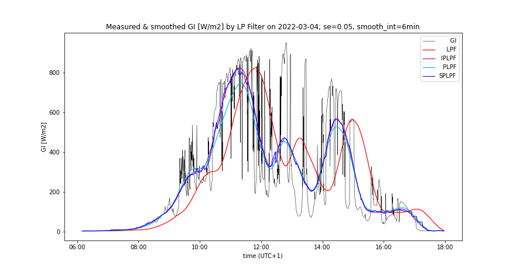{ width="650"}
  <figcaption>Figure 5: Measured and smoothed GI by 4 different methods; better prediction accuracy</figcaption>
</figure>

<figure markdown>
  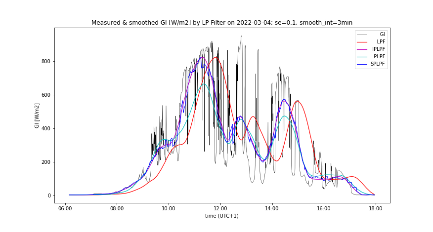{ width="650"}
  <figcaption>Figure 6: Measured and smoothed GI by 4 smoothing methods; worse prediction accuracy</figcaption>
</figure>

<figure markdown>
  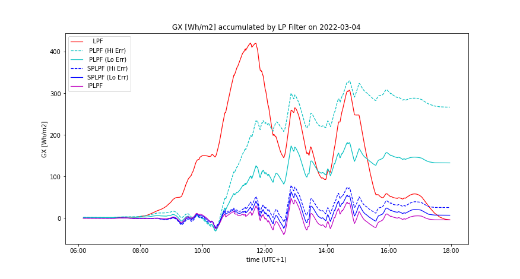{ width="650"}
  <figcaption>Figure 7: Time course of GX accumulated by 4 smoothing methods. (Lo Err: better prediction accuracy, Hi Err: worse prediction accuracy)</figcaption>
</figure>
  
### A day with high insolation

<figure markdown>
  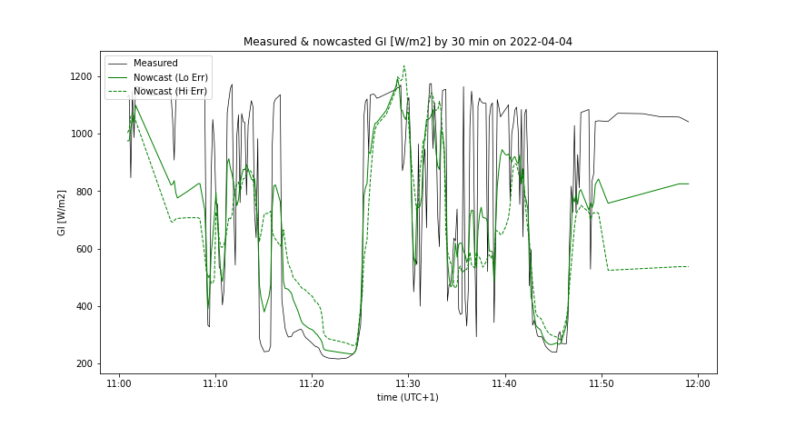{ width="650"}
  <figcaption>Figure 8: Measured GI synchronized with GIf (predicted 30 minutes ago) between 11:00 and 12:00. (Lo Err: better prediction accuracy, Hi Err: worse prediction accuracy)</figcaption>
</figure>

<figure markdown>
  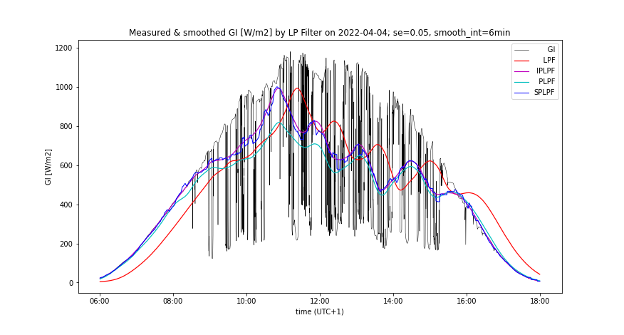{ width="650"}
  <figcaption>Figure 9: Measured and smoothed GI by 4 smoothing methods; better prediction accuracy</figcaption>
</figure>

<figure markdown>
  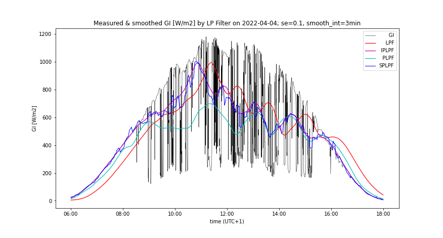{ width="650"}
  <figcaption>Figure 10: Measured and smoothed GI by 4 smoothing methods; worse prediction accuracy</figcaption>
</figure>

<figure markdown>
  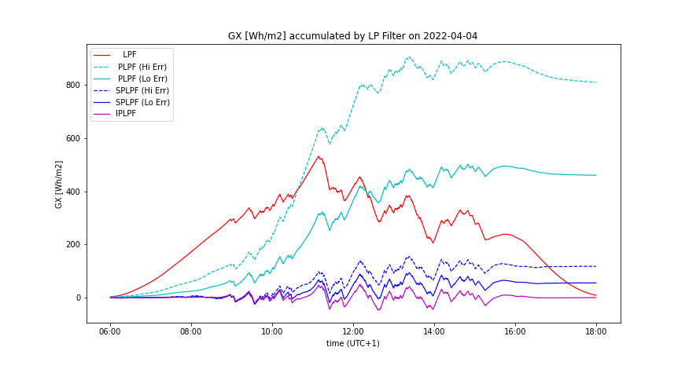{ width="650"}
  <figcaption>Figure 11: Time course of GX accumulated by 4 smoothing methods. (Lo Err: better prediction accuracy, Hi Err: worse prediction accuracy)</figcaption>
</figure>
  
## Analysis by LPF order

Following graphs compare the smoothing by IPLPF vs SPLPF method:

### A day with medium insolation

<figure markdown>
  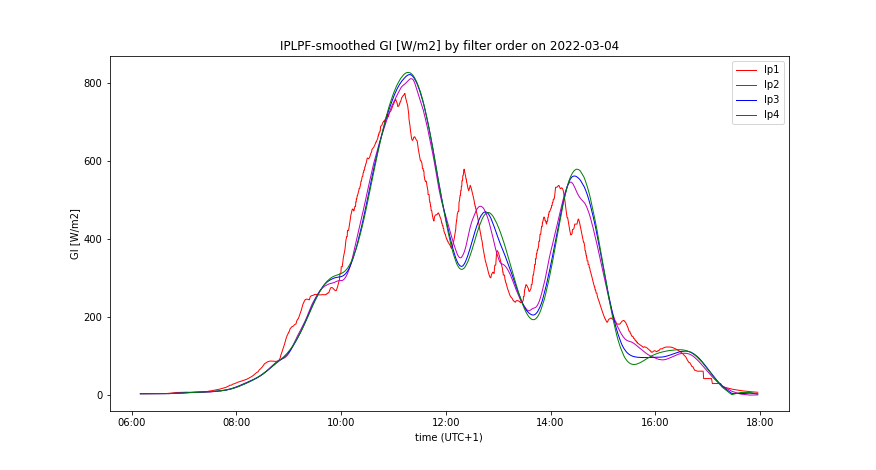{ width="650"}
  <figcaption>Figure 12: Time course of IPLPF-smoothed GI exhibits similar ramping for each filter order</figcaption>
</figure>
  
<figure markdown>
  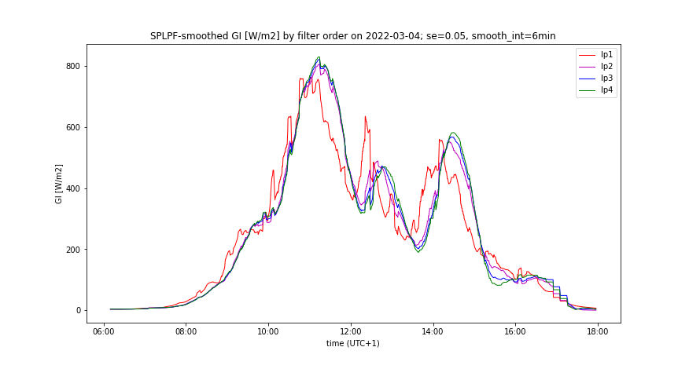{ width="650"}
  <figcaption>Figure 13: Time course of SPLPF-smoothed GI by filter order; better prediction accuracy</figcaption>
</figure>
  
<figure markdown>
  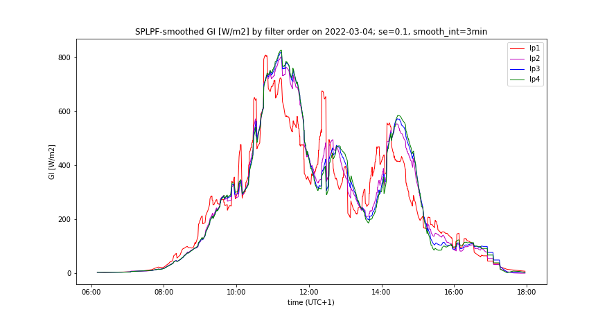{ width="650"}
  <figcaption>Figure 14: Time course of SPLPF-smoothed GI by filter order; worse prediction accuracy</figcaption>
</figure>
  
<figure markdown>
  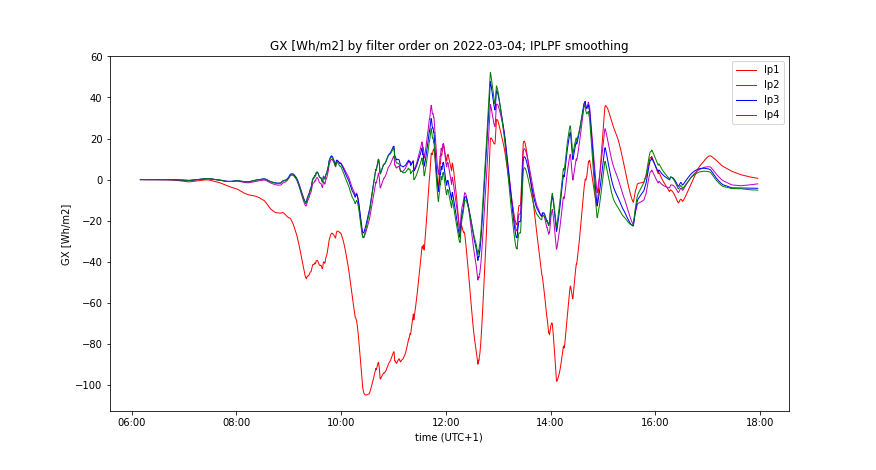{ width="650"}
  <figcaption>Figure 15: Time course of IPLPF-accumulated GX by filter order</figcaption>
</figure>
  
<figure markdown>
  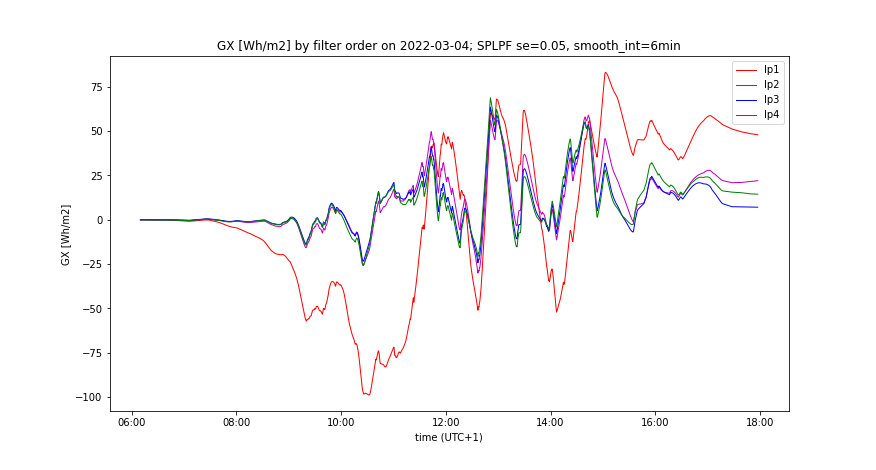{ width="650"}
  <figcaption>Figure 16: Time course of SPLPF-accumulated GX by filter order; better prediction accuracy</figcaption>
</figure>
  
<figure markdown>
  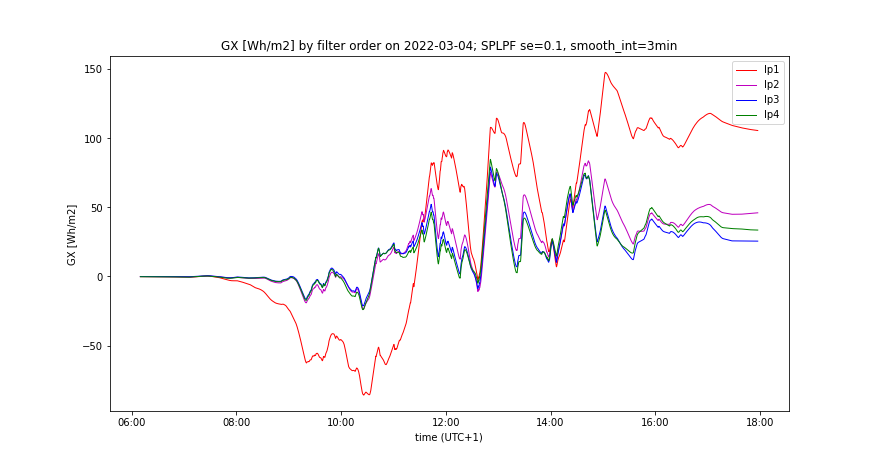{ width="650"}
  <figcaption>Figure 17: Time course of SPLPF-accumulated GX by filter order; worse prediction accuracy</figcaption>
</figure>
.  

### A day with high insolation

<figure markdown>
  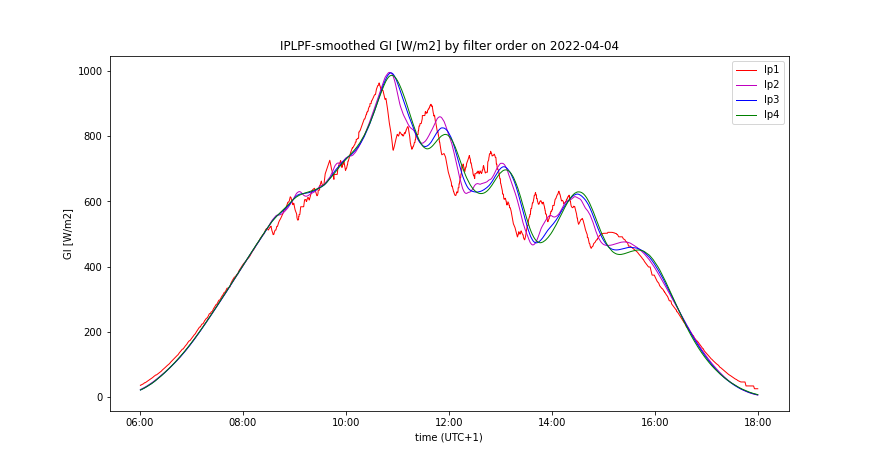{ width="650"}
  <figcaption>Figure 18: Time course of IPLPF-smoothed GI shows its similar ramping for each filter order</figcaption>
</figure>
  
<figure markdown>
  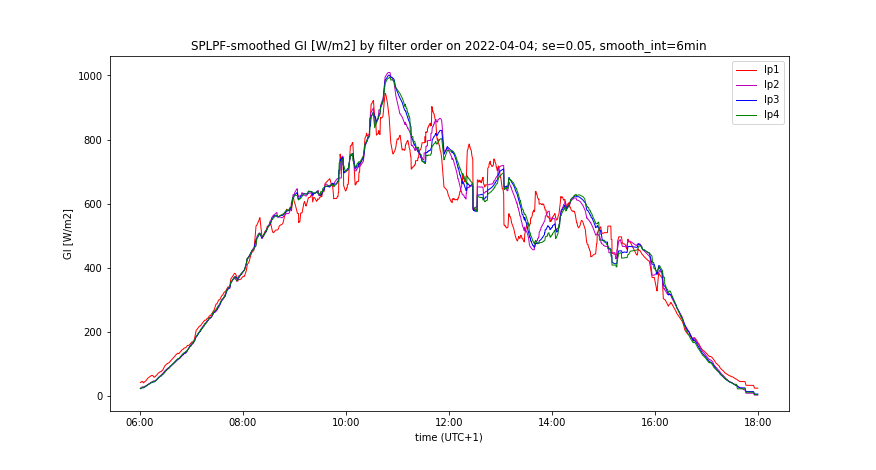{ width="650"}
  <figcaption>Figure 19: Time course of SPLPF-smoothed GI by filter order; better prediction accuracy</figcaption>
</figure>
  
<figure markdown>
  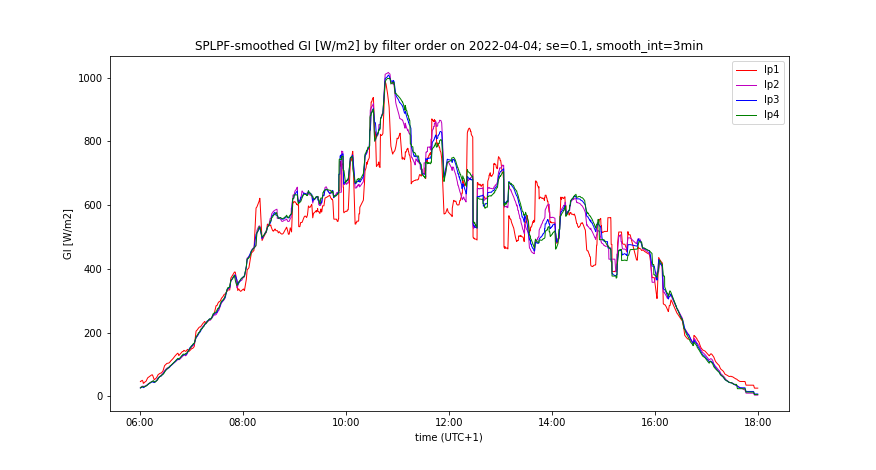{ width="650"}
  <figcaption>Figure 20: Time course of SPLPF-smoothed GI by filter order; worse prediction accuracy</figcaption>
</figure>
  
<figure markdown>
  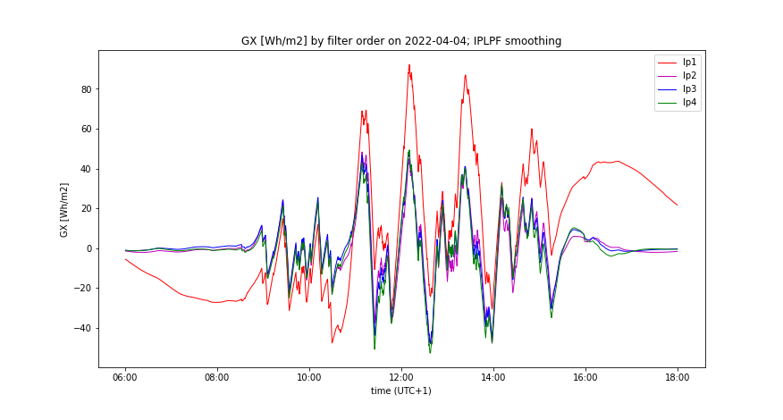{ width="650"}
  <figcaption>Figure 21 Time course of IPLPF-accumulated GX by filter order</figcaption>
</figure>
  
<figure markdown>
  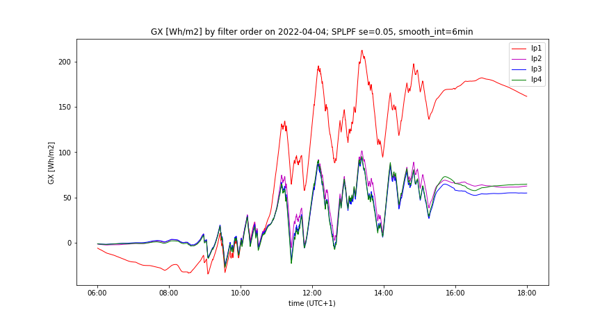{ width="650"}
  <figcaption>Figure 22: Time course of SPLPF-accumulated GX by filter order; better prediction accuracy</figcaption>
</figure>
  
<figure markdown>
  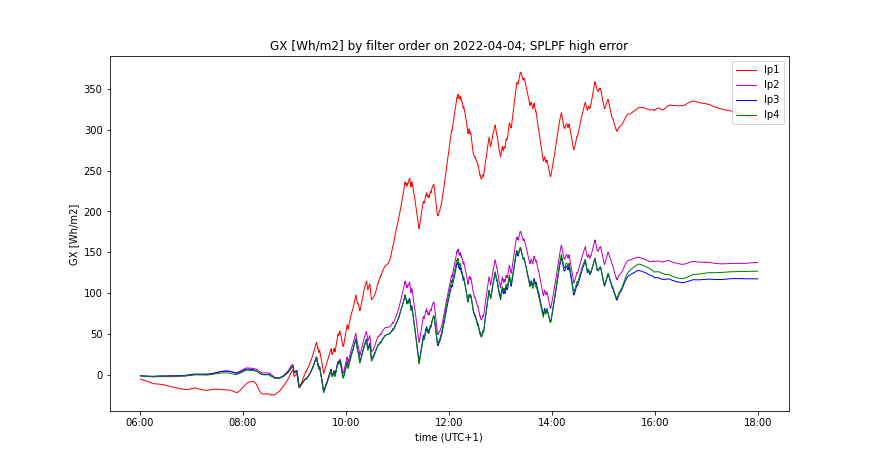{ width="650"}
  <figcaption>Figure 23: Time course of SPLPF-accumulated GX by filter order; worse prediction accuracy</figcaption>
</figure>
