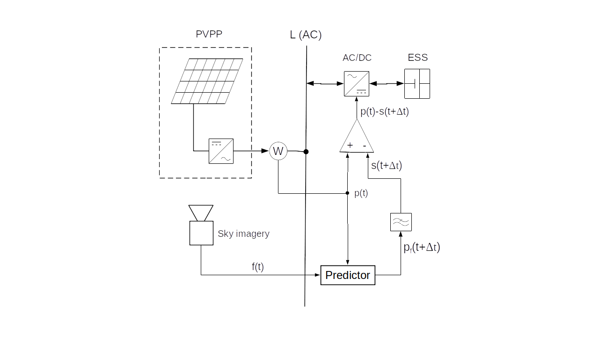
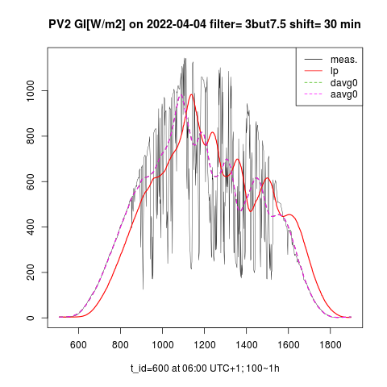
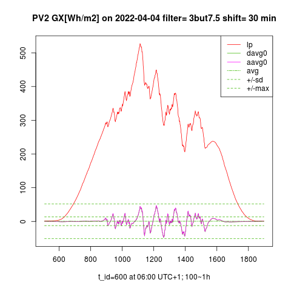
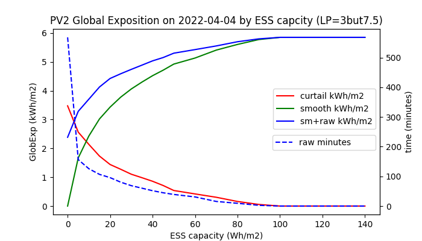
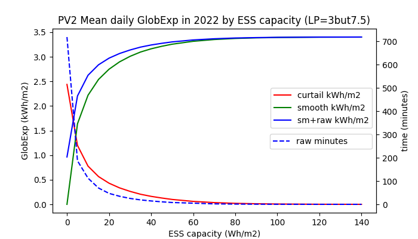
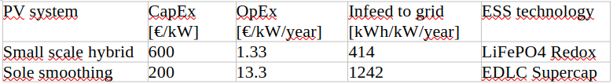

## Lossless smoothing of renewable power
The objective is to meet the given ramping limits of RES power while accumulating a minimum of energy by its lossless smoothing. If the smooth power is generated by a [low-pass filter (LPF)](https://en.wikipedia.org/wiki/Low-pass_filter) excited by the renewable power, then such a power filter induces high accumulation costs due to its time lag (group delay in its frequency response). The filter's time lag could be eliminated in theory, if the LPF was excited by a future time course of the RES power. Unfortunately, the time course of RES power is random and its short-time prediction (nowcasting) is not exact and this error considerably increases the energy accumulated by LPF. Recently, various 
[predictive filters](https://www.sciencedirect.com/science/article/abs/pii/S1364032119304459)
 e.g. 
[zero group-delay filter](https://www.planetanalog.com/five-things-to-know-about-prediction-and-negative-delay-filters/)
, [Kalman filter](https://www.kalmanfilter.net/default.aspx)
 have been examined to avoid the accumulation of energy caused by the time lag of LPF. These filters seemingly operate as a system, integrating the predictor and LPF into one functional unit potentially accumulating less energy than a standard LPF excited by the predicted RES power. However, they are trained only by a historical information from the measured power signal p(t), lacking additional information e.g. from the sky imagery. As a result, the accumulation costs raised by such filters still exceed the production costs of fossil and nuclear electricity (assuming current social cost of CO~2~ and nuclear waste).  
Our analysis will be focused at first on the application of a
standard LPF excited by a [PV predictor](https://www.sciencedirect.com/science/article/abs/pii/S0038092X14001327)
trained by both sky imagery and p(t) signals. We further integrate these two into a single functional entity, exploiting the system benefit of predictive filters whilst maximizing the training information for the power nowcasting.

<figure markdown>
  { width="650"}
  <figcaption>Figure 1: Smoothing of PV power by a low-pass filter</figcaption>
</figure>

In the schematic diagram on Figure 1, a PV power plant (PVPP) is connected to the grid and its intermittent power p(t) is accumulated or compensated (smoothed in summary) by an accumulator (ESS). The smoothing power is actuated by a bidirectional inverter AC/DC, and it is determined by the ouput signal p(t)-s(t+Δt) of a subtractor. A positive sign of the smoothing power is oriented from the grid to ESS. Thus a total power superimposed to the grid by PVPP and ESS is determined by the filter’s output signal s(t+Δt). For the simplification, PVPP and ESS are single-phase connected to the grid. Four different power smoothing concepts will be analysed:

- In case of **LPF** smoothing, the measured signal p(t) bypasses the predictor, directly exciting LPF.

- In theory, the ideal predictive smoothing [IPLPF](https://mhrons.github.io/pv_smooth/#ideal-pv-smoothing-iplpf) excites the LPF by the exact future PV power signal p(t+Δt) where the lead time interval Δt compensates for the time lag of  LPF. The smooth power signal s(t+Δt) is a response of LPF to the input signal p(t+Δt).

- According to the schematic diagram, **PLPF** smoothing method excites the LPF with a predicted PV power signal p~f~(t+Δt), approximating the signal p(t+Δt). The predictor is trained by a sky-imagery signal and by the measured PV power p(t).

- Finally, a smart smoothing method [SPLPF](https://mhrons.github.io/splpf/) has been proposed, integrating the LPF with a PV predictor trained by both  measured PV power p(t) and sky-imagery. This method has a modified block diagram.

## Energy accumulated by smoothing
For the clarity of analysis, energy losses in the AC/DC power conversion and energy storage will be neglected. The time course of the accumulated energy by ESS  

$$SOC(t)=\int_{0}^t (p(\tau)-s(\tau+\Delta t))d\tau\tag{1}\label{eq:1}$$

expresses the change in state-of-charge [Wh] since the time 0 until t. While the integral may acquire both positive and negative values, always-positive SOC values are technically managed by precharging the ESS to SOC~0~ at the time 0 (e.g. at the begining of PV cycle). The lead time Δt reduces absolute values of the integrated function. The IPLPF-defined signal s(τ+Δt) ensures that following 4 technical criteria are satisfied:  
Mean value of *SOC(t)* is near to zero:  

$${1 \over T} \int_{0}^T SOC (t) dt ≈ 0\tag{2}\label{eq:2}$$

Mean quadratic deviation of *SOC(t)* is near to minimum:  

$${1 \over T} \int_{0}^T SOC^2 (t) dt ≈ min\tag{3}\label{eq:3}$$

Hence the required storage capacity per cycle *T* (24 hours in case of PV power p(t)) is close to the minimum:  

$$\Delta SOC = max(SOC) – min(SOC) ≈ min\tag{4}\label{eq:4}$$

Throughput of the accumulated energy per cycle *T* is near to its minimum:

$${1 \over 2} \int_{0}^T|p(\tau)-s(\tau+\Delta t)|d \tau ≈ min\tag{5}\label{eq:5}$$

The ***accumulation rate*** is quantified by \eqref{eq:4} and \eqref{eq:5} and by the demanded power from/to ESS during a sudden loss or a peak of direct sunlight:  

$$P_{ESS}=max|p(\tau)-s(\tau+\Delta t)|\tag{6}\label{eq:6}$$

In practise, *P~ESS~* does not exceed 80% of the installed PV power.  

### Specific accumulation rate ###
Let us first discuss the proportionality between PV power and global irradiance GI: By definition, GI should be measured at a single point in the plane of incidence. In our experiment, the solar irradiance is intercepted by a small planar panel fixed on the earth’s surface. A real PV power p(t) is usually smoother than GI(t) as the (usually greater) surface area of the corresponding PV plane acts like a moving-average filter of GI(t). Unfortunately, the surface area of PV plants is not enough large to aggregate a sufficient smoothing effect. So by assuming the proportionality between GI(t) and p(t), we will analyze the worst case of PV intermittency.  
For the sake of general validity of our analysis, we will substitute the signals p(τ), s(τ+Δt) in \eqref{eq:1}, \eqref{eq:5}, \eqref{eq:6} with the measured signal GI(τ) and with its “predicted-and-smoothed” counterpart GI~s~(τ+Δt). After substitution, the intergal \eqref{eq:1} determines a time course of the specific stored energy GX(t) [Wh/m^2^] by the filter, whereas *SOC(t)* is approximately proportional to GX(t). The integral \eqref{eq:5} then computes a specific accumulated throughput [Wh/m^2^] per cycle T.  
The measured signal GI(t) and the applied LPF allow us to aggregate the following three relevant ESS parameters of smoothing:

- specific accumulation capacity ΔGX=max(GX)-min(GX) by \eqref{eq:4},
- specific accumulated throughput by \eqref{eq:5}.
- maximum specific power GI~ESS~=max|GI(τ)-GI~s~(τ+Δt)| by \eqref{eq:6},

These 3 parameters define the specific accumulation rate of smoothing.

### Management of positive SOC ###
How should the value SOC~0~ be preset? Assume, that the prerequisite \eqref{eq:2} holds. Let us split the ESS into 2 batteries from which the first one is fully charged and the other one is empty at the beginning of a cycle T. The smoothing power is rectified such that the precharged accumulator is being exclusively discharged whilst the empty one is being exclusively charged by the smoothing, unless the first one is empty or the other one is full. At this moment their roles will be exchanged and so forth until the end of the cycle T. The IPLPF smoothing ensures that \eqref{eq:2} holds so there is a stable balance between the charging and discharging of those two batteries throughout the whole cycle T. If microcycling is not harmful to the ESS, then 1 accumulator is sufficient - being precharged to SOC~0~ = 1/2 * SOC~max~ at the beginning of cycle T, assuming that SOC~max~ > max(SOC) - min(SOC).  

## Ideal PV smoothing (IPLPF)
The ideal predictive smoothing (IPLPF) has been numerically simulated by means of a LPF, ex-post excited by the future signal GI(t+Δt) where GI(t) is measured and the lead time interval Δt eliminates the LPF’s time lag.  

### IPLPF vs LPF smoothing   
{: style="width: 49%; align='left';"}
{: style="width: 49%; align='right';"}
<figure markdown>
  <figcaption>Figure 2: Global irradiance GI measured, filtered by LPF (legend lp) and by IPLPF (legend davg0, aavg0), and the specific energy GX accumulated by LPF vs IPLPF</figcaption>
</figure>

The graphs on the left show the measured signal GI(t), low-passed GI~s~(t) (legend “lp”), and left-shifted low-passed GI~s~(t+Δt) (legend "aavg0") on a day with high solar exposure and strong intermittency. The graphs on the right show the time course of specific energy GX(t) [Wh/m^2^] accumulated by IPLPF (legend "aavg0") vs GX(t) accumulated by LPF (legend "lp") on the same day. Exactly predicted input signal GI(t+Δt) minimizes the standard deviation of GX(t), in practise minimizing the difference ΔGX = max(GX) – min(GX), thus defining a requirement for the specific accumulation capacity. The specific throughput of the accumulated energy is also minimized by the IPLPF smoothing.  

### LPF tuning
The lead time interval Δt is equal to the LPF's group delay τ~g~(f) at frequencies from interval 0<f<<f~c~ where f~c~ is the [cut-off frequency](https://en.wikipedia.org/wiki/Cutoff_frequency) of LPF. In case of PV power, Δt can be well estimated by τ~g~(0) as the major spectral components of GI are 0 and the very low frequency of day-night cycling, while the GI spectral components generated by the atmosphere (those to be filtered) are much higher. The filter's group delay can be tuned by its parameters f~c~ and [order](https://en.wikipedia.org/wiki/Low-pass_filter#Electronic_low-pass_filters). The higher order or the lower f~c~, the greater Δt and the smoother output power. Technically, Δt expresses the smoothing effect of LPF which in turn determines the ramping of output power. To meet a given ramping limit, various filter orders and f~c~ values can be combined accordingly. The accumulation rate slightly varies within relevant f~c~ and order combinations. Its minimum is subject of further optimizing of these two variables.   

### Measurement of intermittency
In theory, IPLPF minimizes the storage capacity \eqref{eq:4} and the energy throughput \eqref{eq:5} of the lossless power smoothing. Assume now having such a tuned LPF, the output power signal of which complies with the reference power ramping limit. Under such conditions, the specific accumulation rate of IPLPF can be considered as a quantifier of the solar intermittency. This also indicates a potential affordability of the power smoothing, assuming that a real smoothing technology exists or will exist, performing close to the ideal smoothing. Our numerical experiment based on the measured solar irradiance over a period of >1 year proves that such a [SPLPF](https://mhrons.github.io/splpf/) smoothing already exists. A numeric and graphic comparation of both IPLPF and SPLPF is shown below.

### Cost-benefit by variable ESS
The smoothing costs result from the accumulation technology and from the accumulation rate. The accumulation rate results from the solar intermittency, desired ramping of PV power, and from the smoothing method. IPLPF minimizes the necessary ΔSOC and throughput, but cannot reduce the power of accumulation. Let us first concentrate on a minimum ΔSOC (Wh capacity of ESS) demanded by the IPLPF smoothing, regardless of the ESS power needed. The dashed green lines in Figure 2 display the maximum-minimum ΔGX of the day (96 Wh/m^2^ on 2022-04-04) and the standard deviation of GX. The maximum-minimum ΔGX specifies the necessary ESS capacity for uninterrupted IPLPF smoothing on the given day. Let us now analyze what happens, if less ESS capacity is available than the maximum-minimum ΔGX:  

{: style="width: 49%; align='left';"}
{: style="width: 49%; align='right';"}
<figure markdown>
  <figcaption>Figure 3: Smooth, raw, and curtailed daily PV energy by ESS capacity</figcaption>
</figure>

***Following 3 cases will occure during a PV cycle:***  
1) When the GX values remain within the given ΔGX interval, then IPLPF smoothing works uninterrupted. This holds for all GX values on 2022-04-04, if the specific ESS capacity ΔGX ≥ 96 Wh/m^2^ as it is shown in Figures 2, 3, and written in [Table 3](https://mhrons.github.io/sim_smooth/#accumulation-rate-by-method).  
2) When the GX value exceeds the upper limit of ΔGX interval, then the PV power cannot be stored any more because the ESS is already full. The PV power must be either curtailed (by mistuning the MPPT controller), or fed unfiltered to the grid (like the black GI curve in Figure 2). Although the power curtailment means energy losses, there are not so many days exceeding the upper limit of ΔGX interval. The smooth power can be fed into the grid even on these days, although in less volume than the raw power would be. Rather curtail the excessive intermittent PV power than feed it unfiltered to the grid. The red line in Figure 3 shows the daily energy losses as a function in ESS capacity.  
3) When the GX values pass below the lower limit of ΔGX interval, then the missing PV power cannot be supplied by the empty ESS anymore. Now there is no better choice but to feed the low raw PV power directly to the grid (better than nothing). The blue line shows the sum "smooth" plus "low raw" daily energy infeed as a function in ESS capacity, whereas the green line shows only the "smooth portion" of delivered energy. The dashed blue line eventually aggregates the total time interval of day while the low raw power was fed to the grid.  
Daily mean values aggregated from the whole year 2022 show that the specific ESS capacity 40 Wh/m^2^ appears to be sufficient in average, although its ΔGX inteval is less than 1/2 of the maximum-minimum ΔGX request on 2022-04-04.  

The requested ***power*** of ESS is aggregated as the maximum absolute difference between the input and filtered power. This is 631 W/m^2^ on 2022-04-04 (maximum of the year) shown in [Table 3](https://mhrons.github.io/sim_smooth/#accumulation-rate-by-method) with the LPF time lag Δt = 30 minutes. Hence the relative power of ESS ≤ (631/40)h^-1^ = 15.8 h^-1^. Since this figure is calculated from the measured GI(t) and not from the real PV power, the requested ESS power is lower in a real PV plant due of the inherent smoothing provided by its surface area. Actually, such a high relative power cannot be provided by redox accumulators, but by ***EDLC supercapacitors*** or by ***flywheells (FESS)*** with magnetic bearings.  
Although the IPLPF shrinks the necessary capacity and the accumulated throughput to their theoretical minimum, on the contrary it demands a high relative smoothing power GI~ESS~/ΔGX [h^-1^], as it is shown in [tables 2 and 3](https://mhrons.github.io/sim_smooth/#accumulation-rate-by-method). Regardless of its small capacity, the ESS must supply the missing PV power when the direct sun beams are temporarily shadowed by clouds, or vice versa.  
However, if the ESS still provides more power than is needed by IPLPF (and the rest ESS does not generate [synthetic inertia](https://mhrons.github.io/pv_intermit/#smoothing-synthetic-inertia) concurrently with smoothing), then its specific capacity ΔGX could be even decreased below the recommended 40 Wh/m^2^: Knowing the infeed tariff, price and the service interval of ESS, the ΔGX interval can be optimized by equalizing the cost margins of the lost PV energy and saved ESS capacity. However, accounting for the impact caused by the increased raw PV infeed 3) is more complex.

### Hybrid PV system  
Neither supercapacitors nor flywheels are cheap, and yet there exist hybrid PV systems having inherent LiFePO4 storage providing more than enough power for the infeed smoothing. Assume a household connected to the low-voltage grid, having 10kW installed PV power and a LiFePO4 BESS with the energy capacity ≈ 2h x installed PV power. The hybrid PV system starts feeding its excessive PV power to the grid since the battery is full and the household’s consumption is satisfied. If the battery charging stopps at around 87% of SOC~max~, then such a BESS has still enough free capacity to smooth the excessive PV infeed with a relative power only 631W/2kWh ≈ 0.32 h^-1^ on 2022-04-04. Evem with the maximum ΔGX request, only 96Wh/2kWh = 4.8% of ESS capacity would be consumed by the IPLPF smoothing on 2022-04-04, though less on average days. Additional technical measures have to avoid the microcycling of BESS - e.g. usage of two independent batteries.

### PV smoothing costs
Based on the specific accumulation rate measured over a time span of 1+ year, based on the EDLC and LiFePO4 contemporary prices and LiFePO4 lifecycle data, the IPLPF smoothing costs have been calculated. The numeric results show that IPLPF is worthwhile with the German electricity purchase tariff and with the PV feed-in tariff as of 2021. The ideal smoothing costs are substantially lower than the difference between the purchase and PV feed-in tariffs (assuming that the smooth PV infeed partially eliminates the distribution costs). 

IPLPF costs based on annual GI data (2022). The plane of incidence and applied LPF match with Figure 2, Tables 2, 3:    
<figure markdown>
  { width="650"}
  <figcaption>Table 1: Specific IPLPF costs</figcaption>
</figure>

**Conditions of the cost calculation:**  
The costs are specific per 1 kW of installed PV power.  
1/3 of the anually-generated PV energy by the hybrid PV system is assumed as infeed to the grid.  
Microcycling of LiFePO4 ESS is eliminated by technical means.  
LiFePO4 [life cycle data](https://www.powertechsystems.eu/home/tech-corner/lithium-iron-phosphate-lifepo4/) (expected 6000 cycles) and price 290 €/kWh as of 2025  
EDLC price 5000 €/kWh, expected lifetime 15 years, ESS capacity 40 Wh/kW.  
Energy losses due to AC/DC conversion and accumulation are neglected.  
CapEx = initial investment to the smoothing    
OpEx = regular (e.g. yearly) costs of smoothing.  
CapEx in a hybrid PV system includes 85% BESS capacity reserved for hybrid storage, 5% for smoothing.
The greater from (CapEx, service_interval * OpEx) defines the cost of IPLPF smoothing for a given service interval.  

Having a small part of LiFePO4 BESS capacity reserved but its power available in a hybrid PV system, the IPLPF smoothing costs <5% increase in the BESS capacity. Such a possibility is significant in grid areas with a high concentration of small-scale hybrid PV systems.  
EDLC supercapacitors deliver a cost-effective IPLPF smoothing to the utility-scale PV plants. Furthemore, the price of EDLC is expected to drop to 1000 €/kWh in the future.

### Wind power smoothing
Long-term continous GI(t) measurement has confirmed that if the PV power smoothing performed close to ideal, it would be affordable either with LiFePO4 or with EDLC storage technology. The wind power exhibits similar intermittency like the PV power, albeit with a relevant exception: Due to a relatively weak influence of day-night cycles on wind, the major low spectral component of wind power is random, hence τ~g~(0) is not the optimal lead time Δt, but Δt has to be continously adjusted in order to minimize the requested ESS capacity. While the instantanesous wind power has to be nowcasted, its major low spectral component has to be predicted in a longer time horizon.  

### Summary of IPLPF
***Extremely low accumulated energy by IPLPF should motivate the research of technologies, among which the high-power storage, accurate nowcasting of renewable power, and its smart filtering are key.*** In the PV smoothing, IPLPF needs between 18% and 20% of ΔSOC relative to LPF, and IPLPF accumulates between 57% and 70% of the energy through ESS relative to LPF - see Tables 2, 3 in the [numerical results](https://mhrons.github.io/sim_smooth/#accumulation-rate-by-method). In a ***non-ideal smoothing***, the values \eqref{eq:4} and \eqref{eq:5} are larger the less perfectly controlled the balancing of power between the grid and ESS. In the rest of this report, the smart filtering of RES power (performing close to IPLPF) will be analysed in detail.
