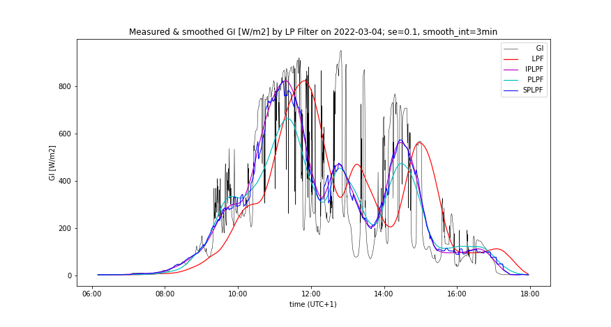

#Lossless smoothing of renewable power
The objective is to meet the given ramping limits of RES power while accumulating a minimum of energy by the lossless smoothing of intermittent power. If the smooth power is generated by a low-pass filter (LPF) excited by the RES output power, then such a power filter induces high accumulation costs due to its time lag (a group delay in its frequency response). The higher LPF order or its lower cut-off frequency, the smoother output but the greater time lag. The time lag could be eliminated in theory, if the LPF was excited by a future time course of the RES power. Unfortunately, the time course of RES power is random and its short-time prediction (nowcasting) is not exact and this error considerably increases the energy accumulated by LPF. Recently, various 
[predictive filters](https://www.sciencedirect.com/science/article/abs/pii/S1364032119304459)
 e.g. 
[zero group-delay filter](https://www.planetanalog.com/five-things-to-know-about-prediction-and-negative-delay-filters/)
, [Kalman filter](https://www.kalmanfilter.net/default.aspx)
 have been examined to avoid the accumulation of energy due to the time lag of LPF. These filters seemingly operate as a system, integrating the predictor and LPF into one functional unit potentially accumulating less energy than a standard LPF excited by the predicted RES power. However, they are trained only by a historical information from the measured power signal p(t), lacking a predictive information e.g. from the sky imagery. As a result, the accumulation costs raised by such filters still exceed the production costs of fossil and nuclear electricity (assuming current social cost of CO~2~ and nuclear waste).  
Our analysis will be focused at first on the application of a
[standard LPF](https://www.analog.com/en/design-center/glossary/low-pass-filter.html)
 excited by a 
[PV predictor](https://www.sciencedirect.com/science/article/abs/pii/S0038092X14001327)
  trained by both sky imagery and p(t) signals. We further integrate these two into a single functional entity, exploiting the system benefit of predictive filters and maximizing the training information for the power nowcasting.

<figure markdown>
  { width="650"}
  <figcaption>Figure 1: Smoothing of PV power by a low-pass filter</figcaption>
</figure>

In the schematic diagram on Figure 1, a PV power plant (PVPP) is connected to the grid and its intermittent power p(t) is accumulated or compensated (=smoothed) by an accumulator (ESS). The smoothing power is actuated by a bidirectional inverter AC/DC, and it is determined by the ouput signal p(t)-s(t+Δt) of a differencer. A positive sign of the smoothing power is oriented from the grid to ESS. Thus a total power superimposed to the grid by PVPP and ESS is determined by the filter’s output signal s(t+Δt). For the simplification, PVPP and ESS are single-phase connected to the grid. Four different power smoothing concepts will be analysed:

- In case of **LPF** smoothing, the measured signal p(t) bypasses the predictor, directly exciting LPF.

- In theory, the ideal predictive smoothing **IPLPF** excites the LPF by the exact future PV power signal p(t+Δt) where the time advance Δt is absolutely equal to the LPF's group delay at frequencies f<<f~c~ where f~c~ is the cut-off frequency of LPF. The smooth power signal s(t+Δt) is a response of LPF to the input signal p(t+Δt).

- According to the schematic diagram, **PLPF** smoothing method excites the LPF with a predicted PV power signal p~f~(t+Δt), approximating the signal p(t+Δt). The predictor is trained by a sky-imagery signal and by the measured PV power p(t).

- Finally, a smart smoothing method **SPLPF** (patent pending) has been proposed, integrating the LPF with a PV predictor trained by both  measured PV power p(t) and sky-imagery. This method has a modified block diagram.

## Energy accumulated by smoothing
For the clarity of analysis, energy losses in the AC/DC power conversion and energy storage will be neglected. The time course of the accumulated energy by ESS  

$$SOC(t)=\int_{0}^t (p(\tau)-s(\tau+\Delta t))d\tau\tag{1}\label{eq:1}$$

defines the change in the state-of-charge [Wh] since time 0 until time t, while SOC may acquire both positive and negative values. (Always-positive SOC values in ESS can be technically managed.) The time advance Δt reduces absolute values of the integrated function. The IPLPF-defined signal s(τ+Δt) ensures that following 4 technical criteria are satisfied:  
Mean value of SOC is near to zero:  

$${1 \over T} \int_{0}^T SOC (t) dt ≈ 0\tag{2}\label{eq:2}$$

Mean quadratic deviation of SOC is near to minimum:  

$${1 \over T} \int_{0}^T SOC^2 (t) dt ≈ min\tag{3}\label{eq:3}$$

Hence the required storage capacity per cycle T (24 hours in case of PV power p(t)) is close to the minimum:  

$$\Delta SOC = max(SOC) – min(SOC) ≈ min\tag{4}\label{eq:4}$$

Throughput of the accumulated energy per cycle T is near to its minimum:

$${1 \over 2} \int_{0}^T|p(\tau)-s(\tau+\Delta t)|d \tau ≈ min\tag{5}\label{eq:5}$$

The ***accumulation rate*** is quantified by \eqref{eq:4} and \eqref{eq:5} and by the demanded power from/to ESS during a sudden loss or a peak of direct sunlight:  

$$P_{ESS}=max|p(\tau)-s(\tau+\Delta t)|\tag{6}\label{eq:6}$$

In practise, P~EES~ does not exceed 80% of the installed PV power.  

### Specific accumulation rate ###
Let us first discuss a proportionality between the PV power and the global irradiance GI: In our experiment, the solar irradiance is intercepted by planar panels of size 20 cm x 16 cm on the earth’s surface. To be exact, it should be mentioned that p(t) is usually smoother than GI(t), as the (usually greater) surface area of the corresponding PV plane acts like a moving-average filter of GI(t). Unfortunately, the size and speed of clouds prevent a relevant smoothing effect from being achieved by the existing PV surface. By assuming the proportionality between GI(t) and p(t), we analyze the worst case of PV intermittency.  
For the sake of general validity of our analysis, we will substitute the signals p(τ), s(τ+Δt) in \eqref{eq:1}, \eqref{eq:5}, \eqref{eq:6} with the measured signal GI(τ) and with its “predicted-and-smoothed” counterpart GI~s~(τ+Δt). After substitution, the intergal \eqref{eq:1} determines the time course of the specific stored energy GX(t) [Wh/m^2^] by the filter, whereas SOC(t) is approximately proportional to GX(t). The integral \eqref{eq:5} computes the specific accumulated throughput [Wh/m^2^] per cycle T.  
The measured signal GI(t) and the LPF applied allow for the aggregation of specific ESS parameters requested by the smoothing:  

- specific accumulation capacity ΔGX=max(GX)-min(GX) by \eqref{eq:4},
- specific accumulated throughput by \eqref{eq:5}.
- maximum specific power GI~ESS~=max|GI(τ)-GI~s~(τ+Δt)| by \eqref{eq:6},

These 3 aggregates define the specific accumulation rate of smoothing.

### Management of positive SOC ###
Assume that the prerequisite \eqref{eq:2} holds. Let us split the ESS into 2 accumulators, from which the first one is fully charged and the other one is empty at the beginning of a cycle T. The smoothing power is rectified such that the precharged accumulator is being exclusively discharged whilst the empty one is being exclusively charged by the smoothing, unless the first one is empty or the other one is full. At this moment their roles will be exchanged and so forth until the end of the cycle T. The IPLPF smoothing ensures that \eqref{eq:2} holds so there is a stable balance between charging and discharging of the two accumulators throughout the whole cycle T. If microcycling is not harmful to the ESS, then 1 accumulator is sufficient - being precharged to 1/2 of its SOC~max~ at the beginning of cycle T, assuming that SOC~max~ ≥ max(SOC) - min(SOC).  

## Ideal PV smoothing (IPLPF)
We simulate the operation of ideal predictive smoothing (IPLPF) by means of a LPF, ex-post excited by the future signal GI(t+Δt) where GI(t) is measured and the time advance Δt (above defined) eliminates the filter’s time lag. In theory, such an ideal smoothing would minimize the accumulated energy, given the power ramping limit. Using a reference LPF, the specific accumulation rate of IPLPF smoothing ***quantifies the solar intermittency.***  
The IPLPF analysis aims to reveal the ***potential affordability of PV smoothing***, assuming that a real smoothing technology exists or will exist, performing close to the IPLPF. Our numeric experiment is based on the measured solar irradiance over a period of 1 year, and the contemporary prices of LiFePO4 accumulators.  
  

### Smoothing by IPLPF vs LPF  
Global irradiance GI measured, filtered by LPF and IPLPF, and the specific energy GX accumulated by the filters:  
{: style="width: 49%; align='left';"}
{: style="width: 49%; align='right';"}

The left graph shows the measured and low-passed (legend “lp”) GI signals on a day with high solar exposure and strong intermittency. The graph on the right shows the specific accumulated energy GX [Wh/m^2^] by IPLPF (legend "aavg0") vs LPF (legend "lp") on a given day. Exactly-predicted input signal GI(t+Δt) shifts the IPLPF output to the left, minimizing the standard deviation of GX, thus in practise minimizing the difference ΔGX = max(GX) – min(GX), expressing the request for the specific accumulation capacity. The specific throughput of the accumulated energy is also minimized by the IPLPF.  

### Costs of IPLPF smoothing
The smoothing costs result from the accumulation technology and from the accumulation rate. The accumulation rate results from the solar intermittency and from the desired ramping of smoothed PV power. In a non-ideal smoothing (e.g. PLPF), the values \eqref{eq:4} and \eqref{eq:5} are larger the less perfectly controlled the balancing of power between the grid and ESS. In the illustrated example, IPLPF needs between 18% and 20% of ΔSOC relative to LPF, and IPLPF accumulates between 57% and 70% of the energy through ESS relative to LPF (see Tables 2, 3). There is a trade-off between the smoothing effect and the accumulation rate: The lower ramping limit (i.e. smoother s(t)), the higher accumulation rate. (This trend is especially critical in case of PLPF smoothing: The higher Δt, the higher prediction error, and the much higher accumulation rate!) Both ΔSOC and energy throughput reach their theoretical minimum with the IPLPF smoothing.  
Based on the measured GI(t) over a time span of 1 year and the LiFePO4 lifecycle data and prices, the specific accumulation rate of IPLPF has been aggregated and the corresponding smoothing costs have been calculated. The numeric results show that IPLPF operation is worthwhile with the German electricity purchase tariff and the PV feed-in tariff as of 2021. The ideal smoothing costs are substantially lower than the difference between the purchase and PV feed-in tariffs (assuming that the smooth PV infeed partially eliminates the distribution costs). 

#### Small-scale hybrid PV system
A household with the installed PV power <10kW is connected to the low-voltage grid, having a LiFePO4 BESS with energy capacity ≈ 2h x installed PV power. The hybrid PV system feeds its excessive PV power into the grid, as long as the household’s consumption is satisfied and the battery has been charged. If the charging stopped at e.g. 85% SOC~max~, the BESS would further provide enough power to smooth the excessive PV infeed to the grid with a relative power <1 h^-1^, provided that the remaining free BESS capacity is reserved for the IPLPF smoothing (e.g. 7% ΔSOC would had to be reserved for IPLPF on 2022-03-04). Additional technical measures have to avoid its microcycling - e.g. a BESS consisting from 2 independent batteries. IPLPF accumulates energy only on solar-intermittent days, else no storage is needed by IPLPF.  

IPLPF costs measured from 04/2021 to 03/2022. The plane of incidence and the applied LPF correspond to the GI(t) and GX(t) plots:    
<figure markdown>
  { width="650"}
  <figcaption>Table 1</figcaption>
</figure>

#### Conditions of cost calculation:  
1/3 of the yearly-generated PV energy by the hybrid PV system is assumed as infeed to the grid.  
Microcycling of BESS is eliminated by technical means.  
LiFePO4 [life cycle data](https://www.powertechsystems.eu/home/tech-corner/lithium-iron-phosphate-lifepo4/) and per kWh price as of 2021  
Energy losses due to AC/DC conversion and accumulation are neglected.
The costs are specific per 1 kW of installed PV power.  
CapEx = initial investment to PV smoothing includes 90% of the BESS capacity reserved for the basic storage, 10% for smoothing.  
OpEx = regular (e.g. yearly) costs necessary for its uninterrupted operation.  
The greater from (CapEx, sevice_interval * OpEx) defines the cost of IPLPF smoothing for a given service interval.  

***Having a small part of BESS capacity reserved and a total BESS power available, the smoothing by IPLPF is much cheaper than the added value to the PV power infeed is. IPLPF technology offers an affordable smoothing of the PV power infeed in grid areas with a high concentration of small-scale hybrid PV systems.***

### Suitable accumulators for IPLPF
Although the IPLPF shrinks the necessary capacity and the accumulated throughput to their theoretical minimum, it reciprocally increases the relative smoothing power GI~ESS~/ΔGX up to 7 h^-1^, as it is shown by [tables 2 and 3](https://mhrons.github.io/pv_smooth/#accumulation-rate-by-method). Regardless of its reduced capacity, the ESS must supply the missing PV power while the direct sun beams are temporarily shadowed by clouds. Lithium accumulators are cheap, efficient and fast, but not enough powerful to perform a sole IPLPF smoothing. It is not recommended to charge/draw a LiFePO4 battery by a relative power > 1 h^-1^, otherwise the battery’s life cycle would be shortened. Such a high relative power is provided by EDLC supercapacitors (SC), but on contrary to Lithium bateries, these do not provide enough cheap capacity to make the IPLPF smoothing affordable. The currently-available RedOx and EDLC technologies do not harmonize with the IPLPF smoothing demands.  
Actually, the IPLPF might well work with a 
[flywheel (FESS)](https://en.wikipedia.org/wiki/Flywheel_energy_storage)
: 1) The maximum relative power of the FESS covers the IPLPF smoothing demands with a margin. 2) It is expected that the specific cost per kWh of FESS is less than that of SC. 3) Flywheels already regulate frequency in the grid, operating under similar conditions like in the IPLPF smoothing of PV power. (Because of unknown prices and life cycle data, we calculated neither CapExp, nor OpExp of FESS in a role of IPLPF storage.) ***The high relative power and significant stored energy identify flywheels as a candidate accumulator for IPLPF smoothing.***

### Summary of IPLPF
One year of a continous GI(t) measurement has confirmed that if the PV smoothing performed close to the ideal smoothing IPLPF, it would be affordable with LiFePO4 technology when properly implemented in a hybrid PV system (inclusive measures against micro-cycling of BESS).  
The flywheel storage provides the high relative power needed by IPLPF.  
***The low accumulated energy achieved by IPLPF should motivate the further development of technologies among which the high-power accumulation of energy, accurate nowcasting of PV power, and smart filtering of intermitent power are key.***
  
## Real PV smoothing (PLPF, SPLPF)
Now, the objective is to analyze the smoothing effect vs accumulation rate (in summary: performance) of PV smoothing in real conditions. The measured global irradiance signal GI(t) allows not only the simulation of ideal predictive low-pass smoothing (IPLPF), but also a predictive smoothing of PV power (PLPF) having a low-pass filter excited by a real-predicted signal GI~f~(t+Δt). The values GI~f~ are biased by a prediction error. The numeric results will show that this error induces a significant energy accumulated by the PLPF smoothing. We simulated the prediction error into the measured GI values in order to statistically represent the predicted signal GI~f~(t+Δt) and to have a possibility to adjust the prediction error. This allowed us to analyze the impact of the prediction error on the PV power smoothing.  
In addition to PLPF, we have developed a “smart predictive" low-pass smoothing method ***SPLPF*** (patent pending)***, minimizing the accumulated energy \eqref{eq:4}, \eqref{eq:5} with respect to the given ramping limit and real-predicted values GI~f~***. We eventually analyzed the performance of the following smoothing methods:

1. LPF: Input of LPF excited by the measured signal GI(t)
2. IPLPF: Input of LPF excited by the measured, optimally left-shifted signal GI(t+Δt)
3. PLPF: Input of LPF excited by the simulated-predicted signal GI~f~(t+Δt)
4. SPLPF: Smart power filter excited by the simulated-predicted signal GI~f~.

### OLAP analysis
Multi-dimensional [OLAP cube](https://en.wikipedia.org/wiki/Online_analytical_processing) is a set of pre-aggregated accumulation rates along partial dimensions (a few of independent quantitative or categorical variables), provided a constant smoothing effect meets the given ramping limit of the filtered power. Let us define the reference smoothing as the output of a 3rd-order Butterworth filter with the cut-off frequency = 7.5/12h (Δt = 30 minutes). The OLAP cube consists of the following dimensions:

- smoothing method
- LPF order
- smooth_int (prediction error)
- SE (prediction error)

First of all, the same smoothing effect has to be fixed to various LPF used: Low-pass filters of orders 1 to 4 are tuned to output the equal ramping, provided that each filter is excited by the measured, optimally shifted signal GI(t+Δt). With such a tuning, increasing of the LPF order increases its cut-off frequency but only slightly increases the advance Δt. The next goal is to identify the LPF order accumulating a minimum of energy, given the smoothing method, prediction error, and ramping limit. It was found out that the optimal LPF order for SPLPF is also valid for the IPLPF smoothing method. (This is irrelevant for the remaining 2 methods since they accumulate much more energy than IPLPF and SPLPF.) After determining the optimal LPF order, the performance of smoothing methods PLPF and SPLPF was analyzed by a variable prediction error. The numerical results are displayed in tables and graphs, and are explained verbally.

### Simulation of predicted PV power
The group delay of LPF is a physical function of the LPF order and its cut-off frequency. Given the ramping limit, Δt changes only slightly for any relevant combination of the two variables. We can say that Δt represents the smoothing effect of the LPF. The impact of prediction error on GI~f~ values is aggregated at the "future" time t+Δt. The predicted signal GI~f~(t+Δt) is derived from the measured, left-shifted signal GI(t+Δt) by smoothing its "future" time course and by superimposing a random error on it, with respect to the fundamental properties of PV predictors:

- as the advance Δt increases, the (unwanted) smoothing of the predicted signal GI~f~ strengthens
- as the advance Δt increases, the impact of random error on GI~f~ increases (statistically cumulates)

We specify the prediction error by 2 OLAP dimensions:

- Interval of prediction, after passing of which the smoothing impact on the predicted signal is strengthened, is defined by the parameter **smooth_int** [minute]. The shorter this interval, the steeper the smoothing effect rises towards predicted future.
- Standard deviation of the random prediction error **SE** (a dimensionless parameter). A random value is superimposed onto each "future" GI value. This error is re-generated after passing each 6-minute interval of prediction. The impact of random error on GI~f~(t+Δt) is statistically cumulated over interval Δt (obviously greater than 6 minutes).

In this report, we simulate the GI~f~ predictors with two different accuracies:

- “Better prediction accuracy”: smooth_int = 6 minutes, SE = 0.05
- "Worse prediction accuracy": smooth_int = 3 minutets, SE = 0.1.

### Impact of prediction error

The quality and accumulation rate of power smoothing exhibit following dependencies on partial dimensions expressing the prediction error (see Figures 2, 6):

**Smoothed predicted signal**

- Changing of smooth_int affects the smoothing effect neither of SPLPF nor PLPF method, while for all applied values, PLPF performs smoother than SPLPF (Figures 3, 4, 7, 8).
- Lowering of smooth_int dramatically increases the accumulation rate of PLPF, which is always much greater than the accumulation rate of SPLPF (Figures 5, 9). With "worse prediction accuracy", the PLPF method even exceeds the accumulation rate induced by the LPF method (Figure 9). In SPLPF, the accumulation rate increases only slightly and much more slowly than in PLPF.

**Random error in predicted values**

- Increasing of SE has no impact on the smoothing effect of PLPF, but it damages the smoothing of SPLPF (check Figure 7 vs Figure 8). In PLPF, the smoothing effect with a standard error SE > 0 is always better than in SPLPF.
- Increasing of SE significantly increases the accumulation rate of PLPF (Figures 5, 9), which is for all values SE > 0 much higher than the accumulation rate of SPLPF. For some SE values, the PLPF method even exceeds the LPF method in its accumulation rate. The accumulation rate increases only slightly with SPLPF, and less so the higher the filter order (up to 3).

### Analysis by LPF order
The filter order is another OLAP dimension whose impact on the smoothing performance was analyzed along with the prediction error. We analyzed the LPF orders 1 to 4 (Figures 10-21):

- Filter order does not affect the smoothing effect of PLPF method, given a non-zero prediction error. For small filter orders, the output of PLPF is smoother than that of SPLPF.
- Increasing the filter order from 1 to 3 notably improves the smoothing effect of SPLPF, given a non-zero prediction error (Figures 10-12, 16-18).
- Given the prediction error, increasing of the filter order only slightly reduces the accumulation rate of PLPF, and this is always substantially greater than the accumulation rate of SPLPF.
- Increasing of the filter order notably reduces the accumulation rate induced by both IPLPF (zero prediction error) and SPLPF (non-zero prediction error) smoothing methods - see Figures 13-15, 19-21. With the simulated predictor, this trend is reversed between the orders 3 and 4 by the SPLPF method. ***With the simulated predictor, SPLPF performs best with the filter order 3.***

## Numerical results of PV smoothing

The presented results are based on the measured GI data from days exhibiting a strong solar intermittency and a moderate to high insolation. 

### Accumulation rate by method
Specific accumulation rate per date and smoothing method, using the reference filter:
<figure markdown>
  { width="650"}
  <figcaption>Table 2: Date 2022-03-04 medium insolation, strong intermittency</figcaption>
</figure>
  
<figure markdown>
  { width="650"}
  <figcaption>Table 3: Date 2022-04-04 high insolation, strong intermittency</figcaption>
</figure>

Maximum specific power from/to ESS calculated by \eqref{eq:6} is in the column "GI~ESS~". A difference between the maximum and minimum specific accumulated energy calculated by \eqref{eq:4} is in the column "ΔGX". Daily flow of the specific energy through ESS calculated by \eqref{eq:5} is in the column "Throughput". Daily insolation at the plane of incidence is displayed as "Global exposure".

With "better prediction accuracy" during the selected days, the SPLPF smoothing required a relative ESS power between 5.5h^-1^ - 7.2h^-1^ which is 3.8 - 4.8 times more then by the LPF smoothing, 2.4 - 4.2 times more than by PLPF, and eventually 84% - 99% of the IPLPF power request. The SPLPF smoothing required 21% - 22% of the ESS capacity used by the LPF method, or 24% - 41% of the capacity used by PLPF. The SPLPF eventually required 1.0 - 1.2 times the ESS capacity used by IPLPF. The SPLPF smoothing put 58% - 73% of the energy through ESS relative to the LPF method, or 75% - 83% of the energy throughput by PLPF. SPLPF eventually put 1.0 - 1.1 times more energy through ESS than the IPLPF method.

With "worse prediction accuracy" during the selected days, the SPLPF smoothing required a relative ESS power between 3.8h^-1^ - 6.3h^-1^ which is 2.6 - 4.2 times more then by the LPF smoothing, 3.6 - 5.1 times more than by PLPF, and eventually 58% - 86% of the IPLPF power request. The SPLPF smoothing required 24% - 33% of the ESS capacity used by the LPF method, or 19% - 28% of the capacity used by PLPF. The SPLPF eventually required 1.2 - 1.8 times the ESS capacity used by IPLPF. The SPLPF smoothing put 59% - 77% of the energy through ESS relative to the LPF method, or 63% - 69% of the energy throughput by PLPF. SPLPF eventually put 1.0 - 1.1 times more energy through ESS than the IPLPF method.

### SPLPF vs IPLPF
Although we did not analyze the whole year (the numerical simulation of SPLPF is computationally intensive), our analysis of 4 smoothing methods on the selected days with high solar intermittency and various solar exposures, with 4 filter orders, and with a varrying prediction error provides a detailed insight into the SPLPF performance. This smoothing method performs much better than PLPF. ***With a relatively small prediction error, SPLPF performs close to the ideal smoothing IPLPF.*** The presented empirical results have been theoretically justified (part of the patent application).

## PV smoothing graphs
The following graphs show the smoothing effect and accumulated energy depending on the smoothing method and other OLAP dimensions. The measured data on 2 selected days have been processed into the following time series:

- Measured GI(t), synchronized with predicted GI~f~ (1 hour zoomed) - Figures 2, 6
- Measured GI(t) and its smooth counterpart by the prediction accuracy, comparing all smoothing methods, having optimal LPF order applied - Figures 3, 4, 7, 8
- Accumulated GX(t) by the prediction accuracy, comparing all smoothing methods, having optimal LPF order applied - Figures 5, 9
- Smoothed GI(t) by the filter order and prediction accuracy, comparing IPLPF and SPLPF smoothing methods - Figures 10-12, 16-18
- Accumulated GX(t) by the filter order and prediction accuracy, comparing IPLPF and SPLPF smoothing methods - Figures 13-15, 19-21

###  Analysis by prediction error

####  A day with medium insolation

<figure markdown>
  { width="650"}
  <figcaption>Figure 2: Measured GI synchronized with GIf (predicted 30 minutes ago) between 11:00 and 12:00. (Lo Err: better prediction accuracy, Hi Err: worse prediction accuracy)</figcaption>
</figure>

<figure markdown>
  { width="650"}
  <figcaption>Figure 3: Measured and smoothed GI by 4 different methods; better prediction accuracy</figcaption>
</figure>

<figure markdown>
  { width="650"}
  <figcaption>Figure 4: Measured and smoothed GI by 4 smoothing methods; worse prediction accuracy</figcaption>
</figure>

<figure markdown>
  { width="650"}
  <figcaption>Figure 5: Time course of GX accumulated by 4 smoothing methods. (Lo Err: better prediction accuracy, Hi Err: worse prediction accuracy)</figcaption>
</figure>
  
#### A day with high insolation

<figure markdown>
  { width="650"}
  <figcaption>Figure 6: Measured GI synchronized with GIf (predicted 30 minutes ago) between 11:00 and 12:00. (Lo Err: better prediction accuracy, Hi Err: worse prediction accuracy)</figcaption>
</figure>

<figure markdown>
  { width="650"}
  <figcaption>Figure 7: Measured and smoothed GI by 4 smoothing methods; better prediction accuracy</figcaption>
</figure>

<figure markdown>
  { width="650"}
  <figcaption>Figure 8: Measured and smoothed GI by 4 smoothing methods; worse prediction accuracy</figcaption>
</figure>

<figure markdown>
  { width="650"}
  <figcaption>Figure 9: Time course of GX accumulated by 4 smoothing methods. (Lo Err: better prediction accuracy, Hi Err: worse prediction accuracy)</figcaption>
</figure>
  
### Analysis by LPF order

Following graphs compare the smoothing by IPLPF vs SPLPF method:

#### A day with medium insolation

<figure markdown>
  { width="650"}
  <figcaption>Figure 10: Time course of IPLPF-smoothed GI exhibits similar ramping for each filter order</figcaption>
</figure>
  
<figure markdown>
  { width="650"}
  <figcaption>Figure 11: Time course of SPLPF-smoothed GI by filter order; better prediction accuracy</figcaption>
</figure>
  
<figure markdown>
  { width="650"}
  <figcaption>Figure 12: Time course of SPLPF-smoothed GI by filter order; worse prediction accuracy</figcaption>
</figure>
  
<figure markdown>
  { width="650"}
  <figcaption>Figure 13: Time course of IPLPF-accumulated GX by filter order</figcaption>
</figure>
  
<figure markdown>
  { width="650"}
  <figcaption>Figure 14: Time course of SPLPF-accumulated GX by filter order; better prediction accuracy</figcaption>
</figure>
  
<figure markdown>
  { width="650"}
  <figcaption>Figure 15: Time course of SPLPF-accumulated GX by filter order; worse prediction accuracy</figcaption>
</figure>
.  

#### A day with high insolation

<figure markdown>
  { width="650"}
  <figcaption>Figure 16: Time course of IPLPF-smoothed GI shows its similar ramping for each filter order</figcaption>
</figure>
  
<figure markdown>
  { width="650"}
  <figcaption>Figure 17: Time course of SPLPF-smoothed GI by filter order; better prediction accuracy</figcaption>
</figure>
  
<figure markdown>
  { width="650"}
  <figcaption>Figure 18: Time course of SPLPF-smoothed GI by filter order; worse prediction accuracy</figcaption>
</figure>
  
<figure markdown>
  { width="650"}
  <figcaption>Figure 19 Time course of IPLPF-accumulated GX by filter order)</figcaption>
</figure>
  
<figure markdown>
  { width="650"}
  <figcaption>Figure 20: Time course of SPLPF-accumulated GX by filter order; better prediction accuracy</figcaption>
</figure>
  
<figure markdown>
  { width="650"}
  <figcaption>Figure 21: Time course of SPLPF-accumulated GX by filter order; worse prediction accuracy</figcaption>
</figure>

