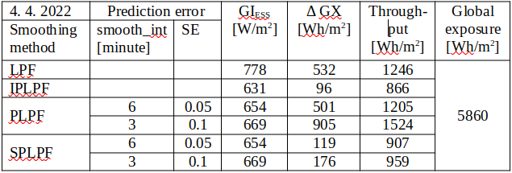

password: Pv$Plpf
#Smoothing of intermittent PV power
The objective of PV smoothing is to meet the ramping limits of PV power (set by a relevant technical standard) while accumulating the minimum possible energy by the filter. If the smooth PV power is generated by a low-pass filter (LPF) excited by the output power of PV panels, such a power filter induces high accumulation costs due to its time lag (group delay in its frequency response). The time lag could be eliminated, if the LPF was excited by a future PV power signal. Unfortunately, the short-time PV prediction (nowcasting) is not exact and its error considerably increases the accumulated energy by the LPF. Recently, various 
[predictive filters](https://www.sciencedirect.com/science/article/abs/pii/S1364032119304459)
 e.g. 
[zero group-delay filter](https://www.planetanalog.com/five-things-to-know-about-prediction-and-negative-delay-filters/)
, [Kalman filter](https://www.kalmanfilter.net/default.aspx)
 have been developed to avoid the accumulation of PV energy due to the LPF time lag and the nowcasting error. Nevertheless, the accumulation of PV power and its cost induced by the predictive filters still exceed the production cost of fossil and nuclear electricity (assuming current social cost of CO~2~ and nuclear waste). The advantage of predictive filters is that they integrate the predictor and LPF into a same functional entity, but their disadvantage is that the predictor is trained by a limited information carried by the measured power signal p(t).  
We focus our analysis on the application of
[LPF](https://www.analog.com/en/design-center/glossary/low-pass-filter.html)
 excited by 
[PV predictor](https://www.sciencedirect.com/science/article/abs/pii/S0038092X14001327)
  trained by the sky imagery and p(t) signals. We further integrate the two into one entity, utilizing the advantage of predictive filters.

<figure markdown>
  { width="650"}
  <figcaption>Figure 1: Smoothing of PV power by a low-pass filter</figcaption>
</figure>

In the schematic diagram on Figure 1, a PV power plant (PVPP) is connected to the grid and its intermittent PV power p(t) is accumulated or compensated (i.e. smoothed) by an accumulator (ESS). The smoothing power is actuated by a bi-directional inverter AC/DC. The smoothing power is determined by the ouput signal p(t)-s(t+Δt) of a differencer. Positive sign of the smoothing power is oriented from the grid to ESS. Hence the total power superimposed to the grid by PVPP and ESS is determined by the filter’s output signal s(t+Δt). For the simplification, PVPP and ESS are single-phase-connected to the grid. We will further analyse 4 different smoothing methods:

- In case of **LPF** smoothing, the measured signal p(t) would bypass the predictor, directly exciting the LPF.

- In theory, an ideal predictive smoothing **IPLPF** would excite LPF by the exact future PV power signal p(t+Δt) where the time advance Δt is absolutely equal to the LPF's group delay at frequencies f<<f~c~ where f~c~ is the cut-off frequency of LPF. The smooth power signal s(t+Δt) would be the response of LPF to the input signal p(t+Δt).

- According to the schematic diagram, **PLPF** smoothing method excites the LPF by a predicted PV power signal p~f~(t+Δt), approximating the signal p(t+Δt). The predictor is trained by the sky-imagery signal and by the measured PV power p(t).

- Eventually, a smart smoothing method **SPLPF** (patent pending) has been designed, integrating the filter with the PV predictor which is trained by the sky-imagery signal and by the measured PV power p(t). This method uses a modified scheme.

## Accumulation of energy by smoothing
For the simplicity of analysis, energy losses in AC/DC conversion and accumulation are neglected.  
Time course of the accumulated energy by ESS:  

$$SOC(t)=\int_{0}^t (p(\tau)-s(\tau+\Delta t))d\tau\tag{1}\label{eq:1}$$

defines the change in the state-of-charge [Wh] since time=0 until time=t, while SOC may acquire both positive and negative values. (Always-positive SOC values in ESS can be technically managed.) The time advance Δt reduces absolute values of the integrated function. The IPLPF-defined signal s(τ+Δt) ensures that following 4 technical criteria are satisfied:  
Mean value of SOC is near to zero:  

$${1 \over T} \int_{0}^T SOC (t) dt ≈ 0\tag{2}\label{eq:2}$$

Mean quadratic deviation of SOC is near to minimum:  

$${1 \over T} \int_{0}^T SOC^2 (t) dt ≈ min\tag{3}\label{eq:3}$$

Hence the required storage capacity per cycle T (24 hours in case of PV energy) is close to minimum:  

$$\Delta SOC = max(SOC) – min(SOC) ≈ min\tag{4}\label{eq:4}$$

The value min(SOC) should be predicted and ESS must be accordingly pre-charged to -min(SOC) at the begining of each cycle T in order to keep SOC≥0 during the cycle.  
Eventually, near-to-minimum throughput of accumulated energy per cycle is achieved by IPLPF:  

$${1 \over 2} \int_{0}^T|p(\tau)-s(\tau+\Delta t)|d \tau ≈ min\tag{5}\label{eq:5}$$

The accumulation rate is expressed by \eqref{eq:4} and \eqref{eq:5}, and also by the demanded power from/to ESS during a sudden loss or peak of direct sunlight:  

$$P_{ESS}=max|p(\tau)-s(\tau+\Delta t)|\tag{6}\label{eq:6}$$

In practise, its maximum value does not exceed 80% of the installed PV power.

Let us expect that the PV power p(t) is proportional to the global solar irradiance GI [W/m^2^]. In our experiment, the solar irradiance is intercepted by a planar panel 20 cm x 16 cm on the earth’s surface at latitude=48.2°N, longitude=17.1°E, with the plane of incidence elevated by 47°, south-oriented. To be exact, we should mention that p(t) is usually smoother than GI(t), as the (usually greater) surface area of the corresponding PV plane acts like a moving-average filter of GI(t). Unfortunately, the size and speed of clouds prevent a true smoothing effect from being achieved. By assuming the proportionality between GI(t) and p(t) we analyze the worst case of PV intermittency. Let us now substitute the signals p(τ), s(τ+Δt) in \eqref{eq:1}, \eqref{eq:5}, \eqref{eq:6} by the measured signal GI(τ) and by its “predicted-and-smoothed” counterpart GI~s~(τ+Δt). After substituting, the intergal \eqref{eq:1} computes the time course of specific accumulated energy GX(t) [Wh/m^2^] by the filter, whereas SOC(t) is proportional to GX(t). The integral \eqref{eq:5} computes the specific accumulated throughput [Wh/m^2^] per cycle T.

## Ideal predictive smoothing (IPLPF)
We simulate the operation of ideal predictive PV smoothing (IPLPF) by means of LPF excited by the exact future signal GI(t+Δt) where GI(t) is measured and the time advance Δt (as above defined) eliminates the filter’s time lag. In theory, such a ex-post simulated smoothing would minimize the accumulation of energy by the given LPF. ***This analysis aims to reveal the potential affordability of PV smoothing.*** The numeric experiment is based on the measured solar irradiance over a period of 1 year, assuming contemporary prices of Lithium-Ion accumulators and EDLC supercapacitors.  
The measured signal GI(t) and applied LPF allow for the aggregation of specific ESS parameters requested by the IPLPF smoothing:

- maximum specific power GI~ESS~=max|GI(τ)-GI~s~(τ+Δt)| by \eqref{eq:6},
- maximum specific energy capacity ΔGX=max(GX)-min(GX) by \eqref{eq:4},
- specific IPLPF-accumulated throughput by \eqref{eq:5}.

These 3 valuesd define the rate of accumulation. ***Assuming the IPLPF smoothing with given LPF as the reference method, the accumulation rate quantifies the solar intermittency.***  
Based on the accumulators' specifications and prices in 2021, the corresponding accumulation costs have been aggregated. The results have confirmed that the IPLPF operation is worthwhile with the German power purchase tariff and PV feed-in tariff as of 2021. The ideal smoothing costs are substantially lower than the difference between purchase and PV feed-in tariffs (assuming that the smooth PV infeed partially eliminates the distribution costs). 
The IPLPF simulation proposes an affordable smoothing model for a hybrid small PV plant and suggests an accumulation technology for a large PV plant.  
### Smoothing by IPLPF vs LPF  
Global irradiance GI measured, filtered by LPF and by IPLPF, and the specific energy GX accumulated by filters:  
{: style="width: 49%; align='left';"}
{: style="width: 49%; align='right';"}

The left graph shows the measured and low-passed (legend “lp”) GI signals on a day with high solar exposure and strong intermittency. The graph on the right shows the specific accumulated energy GX [Wh/m^2^] by IPLPF (legend "aavg0") vs LPF (legend "lp") on the given day. Exactly-predicted input signal GI(t+Δt) shifts the IPLPF output to the left, minimizing the standard deviation of GX, thus in practise minimizing the difference ΔGX = max(GX) – min(GX) which is the specific accumulation capacity. The specific throughput of accumulated energy is also minimized by IPLPF.

### Costs of IPLPF smoothing
The smoothing costs result from the accumulation technology and from the accumulation rate. The latter is a tradeoff between the solar intermittency and the desired time course of the output PV power. In practice, the values \eqref{eq:4} and \eqref{eq:5} are larger the less perfectly controlled the balancing of power between the grid and ESS. In the illustrated example, IPLPF needs only 24% ΔSOC relative to LPF, and IPLPF accumulates about 50% of the energy throughput relative to LPF. Both ΔSOC and energy throughput reach their theoretical minimum by means of IPLPF smoothing.  
The higher LPF order or its lower cut-off frequency, the smoother output, but "earlier" input signal needed to eliminate the filter's time lag. (In case of PLPF smoothing: The greater Δt, the greater prediction error and the greater rate of accumulation!)  
The IPLPF simulation has confirmed that a hybrid PV system i.e. a small-scale on-grid PV plant having its own Lithium battery (BESS) with capacity = 2 hours * P~PVmax~, need <10% of the BESS capacity to be reserved for smoothing (7% on 2022-03-04), while the rest BESS capacity stores energy for the night. The hybrid PV plant feeds its “overflowing” power into the grid, as long as the household’s consumption is satisfied and the battery has been charged. ***Having the reserved free capacity and total battery power available, the IPLPF costs are reasonably lower than the expected added value to the smooth PV power infeed.***  

IPLPF costs measured from 04/2021 to 03/2022. The plane of incidence and the LPF applied are the same as in the GI(t) and GX(t) plots:  
<figure markdown>
  { width="650"}
  <figcaption>Table 1</figcaption>
</figure>

#### Conditions of cost calculation:  
1/3 of the generated PV energy is assumed as infeed to the grid (overflow) by the "Hybrid with BESS” on-grid system.  
Li-Ion & supercapacitor (SC): [life cycle parameters and prices](https://batteryuniversity.com/article/bu-209-how-does-a-supercapacitor-work) are as of 2021.  
Hybrid supercapacitor (HSC): price was estimated upon relation between Li-Ion and SC prices.

The costs are specific per 1 kW of installed PV power. Installed PV power = DC output power of PV plant (before DC/AC conversion) assuming its solar irradiance 1kW/m^2^ (1 Sun).  
CapEx = initial investment to PV smoothing. OpEx = regular (e.g. yearly) costs necessary for its uninterrupted operation. CapEx of "Hybrid with BESS” system include 90% of the BESS capacity reserved for storage, 10% for smoothing. The greater from (CapEx, interval * OpEx) defines the cost of PV smoothing for a given service interval. However, when the smoothing uses >1 accumulation technologies concurrently, the service interval has to be fixed before calculating OpEx. (Reason: Given the service interval, the two technologies with different wear-outs can be optimally mixed.) Hybrid systems and sole PV plants use different cost models, because the sole PV plant uses a mixed accumulation technology for smoothing. Energy losses due to the AC/DC conversion and accumulation were neglected.

### Applications of IPLPF
#### Small-scale hybrid PV system
A household with installed PV power <10kW is connected to the low-voltage grid, having a BESS with energy capacity ≈ 2h x installed PV power. After charging the BESS to a threshold SOC (e.g. 87%), the BESS provides enough power to smooth the PV infeed (overflowing PV power) to the grid for affordable costs, provided that the remaining free BESS capacity is left for smoothing, and additional technical measures avoid the microcycling of BESS. The power intermittency of small scale PV plants has no impact on the grid, unless their concentration in the grid is high. ***IPLPF technology offers an affordable smoothing of PV power in the grid areas with high concentration of small-scale hybrid PV systems.***

#### Suitable accumulators for IPLPF
Although the IPLPF shrinks the necessary capacity and accumulated throughput to their theoretical minimum, it reciprocally increases the relative smoothing power GI~ESS~/ΔGX up to 8 h^-1^. Regardless of its reduced capacity, ESS must supply the missing PV power while the direct sun beams are temporarily obscured by clouds. The lithium accumulators are cheap, efficient and fast, but not enough powerful for a sole IPLPF smoothing. It is not recommended to charge/draw a Li-Ion battery by a relative power >> 1 h^-1^, otherwise the battery’s life cycle would be curtailed. Such a high relative power is provided by EDLC supercapacitors (SC), but on contrary to Lithium bateries, these do not provide enough cheap capacity to make the IPLPF smoothing affordable. The currently-available RedOx and EDLC technologies do not harmonize with IPLPF sole smoothing requirements.  
Actually, the IPLPF demands are well satisfied by a 
[flywheel (FESS)](https://energystorage.org/why-energy-storage/technologies/flywheel-energy-storage-systems-fess/)
: 1) Its maximum relative power 10 h^-1^ poses no limit within demands of IPLPF smoothing. 2) IPLPF accumulates energy only on solar-intermittent days (else no accumulation is needed), and the flywheels wear out only while rotating (FESS with mechanical bearings). Because of unknown prices and life cycle parameters, we calculated neither CapExp, nor OpExp of the flywheel in a role of IPLPF accumulator. However, ***the native synergy between demands and features identifies the flywheel as a suitable accumulator for IPLPF smoothing.***

#### Large-scale PV plant
Water pumps provide efficient storage for large scale PV plants (cheaper and cleaner than corresponding BESS), but no power smoothing because the water pumps are too sluggish for such a role. The large-scale PV intermittency can be smoothed by a relatively low accumulation capacity ΔGX if compared to other smoothing methods, and by the relative power 8 h^-1^. Such technical demands are well satisfied by FESS technology, less by RedOx (low power) or EDLC (too expensive) technologies.
Because of missing FESS prices and wear-out data, we have cost-optimized the IPLPF smoothing for a large-scale PV plant by mixing 2 technologies: SC and HSC concurrently operating during 15 years of service. The future HSC technology is already being developed: 
[hybrid supercapacitor](https://www.sciencedirect.com/science/article/abs/pii/S1364032118307299)
, combining advantages of EDLC & RedOx technologies.

### Summary of IPLPF
One year of continous GI(t) measurement has confirmed that the ideal PV smoothing is affordable with Lithium-Ion technology, if properly implemented in a hybrid PV system (inclusive measures against micro-cycling of the battery). Although the HSC technology is yet unavailable, the intensive seek for energy makes it very likely to be soon mature for large-scale PV installations. The flywheel can be an affordable energy storage for the IPLPF smoothing of PV power. ***Low accumulated energy by IPLPF should motivate the further development of technologies among which accurate nowcasting of PV power and smart filtering of PV power are crucial.***
  
## Real smoothing of PV power
The main objective is to analyze the smoothing quality and accumulation rate (in summary: performance) of the PV power smoothing in real conditions. The measured global irradiance signal GI(t) allows not only the simulation of ideal predictive low-pass smoothing (IPLPF), but also the predictive smoothing of PV power (PLPF), exciting the low-pass filter by a predicted signal GI~f~(t+Δt). The values GI~f~ are biased by a prediction error. As we will show, this error induces a significant accumulation of energy when compared to the IPLPF smoothing. We simulated the prediction error into the measured GI values with the aim to statistically represent the real predicted signal GI~f~(t+Δt) while having a possibility to adjust the prediction error. Hence the measured signal GI(t) allowed us to empirically analyze the performance of the ex-post simulated PLPF method.  
In addition to PLPF, we have developed a “smart predictive" low-pass smoothing method (patent pending SPLPF), minimizing the accumulated energy with respect to the predicted values GI~f~. Finally, we analyzed the performance of four different PV smoothing methods:

1. LPF: Input of LPF is excited by the measured signal GI(t)
2. IPLPF: Input of LPF is excited by the measured, optimally left-shifted signal GI(t+Δt)
3. PLPF: Input of LPF is excited by the simulated-predicted signal GI~f~(t+Δt)
4. SPLPF: Smart power filter excited by the simulated-predicted signal GI~f~.

Smoothing of PV power during selected days with strong solar intermittency and various insolation was analyzed by the four above-listed smoothing methods. For each method, the smoothing quality and rate of accumulation were analyzed by means of various LPF orders. Filters of different orders were tuned to provide equivalent smoothing quality by the reference IPLPF method, provided that the filter of each order is excited by the measured, optimally shifted GI signal. While keeping the equivalent smoothing quality, increasing the order of LPF increases its cut-off frequency, but only slightly increases the optimal advance Δt. The goal is to identify the LPF order which accumulates the minimum energy. The results of analysis have been tabelized and plotted.

### Simulation of predicted PV power
We simulated the predicted signal GI~f~(t+Δt) from the measured, left-shifted signal GI(t+Δt) by smoothing its "future" time course and by superimposing a random error to its "future" value with respect to the fundamental properties of PV predictors:

- as the advance Δt increases, the (unwanted) smoothing of the predicted signal GI~f~ strengthens
- as the advance Δt increases, the impact of random error on GI~f~ increases (statistically cumulates)

Both errors are applied at the "future" time t+Δt where the advance Δt (LPF group delay) result from the demanded quality of smoothing. The group delay is controlled by the order and cut-off frequency of LPF. The goal of GI~f~ simulation is to observe, how does the smoothing quality and accumulated energy depend on the prediction error. We adjust the prediction error by 2 quantitative dimensions (OLAP):

- Interval of prediction, after passing of which the smoothing impact on the predicted signal is strengthened, is defined by the parameter smooth_int [minute]. The shorter this interval, the steeper the smoothing effect rises towards predicted future.
- Standard deviation of the random prediction error (dimensionless parameter SE). A random value is superimposed to each future GI value. This error is re-generated after passing each 6-minute interval of prediction. The impact of random error on GI~f~(t+Δt) is statistically cumulated over Δt.

In this report, we simulate GI predictors with two different accuracies:

- “Better prediction accuracy”: smooth_int = 6 minutes, SE = 0.05
- "Worse prediction accuracy": smooth_int = 3 minutets, SE = 0.1.

### Impact of prediction error

The prediction error (see Figures 2, 6) exhibits the following dependencies of smoothing performance on 2 OLAP dimensions:

**Smoothed predicted signal**

- Changing the value of smooth_int affects the power smoothing quality neither by SPLPF nor by PLPF method, while for all parameter values, the PLPF method is more smooth than the SPLPF method (Figures 3, 4, 7, 8).
- Lowering the value of smooth_int dramatically increases the accumulation rate of PLPF, which is always much greater than the accumulation rate of SPLPF (Figures 5, 9). With the worse prediction accuracy, the PLPF method even exceeds the accumulation rate induced by the LPF method (Figure 9). In the SPLPF method, the accumulation rate increases only slightly and much more slowly than in PLPF.

**Random error in predicted values**

- Increasing the SE parameter does not degrade the power smoothing quality by the PLPF method, but it does degrade the smoothing by SPLPF (check Figure 7 vs Figure 8). In PLPF, the smoothing quality with standard error SE > 0 is always better than in SPLPF.
- Increasing the value of SE parameter significantly increases the accumulation rate by the PLPF method (Figures 5, 9), which is for all values SE > 0 much higher than by the SPLPF method. For some SE values, the PLPF method even exceeds the LPF method in its accumulation rate. The accumulation rate increases only slightly in the SPLPF method, and less so the higher the filter order (1 - 3).

### Analysis by LPF order
Filter order is the third OLAP dimension, impact of which on the smoothing performance was analyzed together with the prediction error. We analyzed the LPF orders 1 to 4 (Figures 10-21):

- Filter order does not affect the power smoothing quality achieved by PLPF method. For small filter orders, the smoothing by PLPF is better than by SPLPF.
- Increasing the filter order from 1 to 3 notably improves the smoothing quality of SPLPF, given the prediction error (Figures 10-12, 16-18).
- Increasing the filter order only slightly reduces the accumulation rate by PLPF which is always substantially greater than the accumulation rate by SPLPF.
- Increasing the filter order notably reduces the accumulation rate induced by both IPLPF and SPLPF smoothing methods (Figures 13-15, 19-21). With the simulated predictor, this trend is reversed between orders 3 and 4 by the SPLPF method. ***With the simulated predictor, SPLPF performs best with the filter order 3.***

## Numeric results of smoothing
Two days with strong solar intermittency have been selected for the simulation: a day with medium solar exposure 3.0 kWh/m^2^, and a day with high solar exposure 5.9 kWh/m^2^ (measured at the above-specified plane of incidence). A 3rd-order low-pass filter excited by the input power signal with time advance Δt = 30 minutes has been applied in order to provide a desired smoothing quality of the PV power. The rate of accumulation by four different smoothing methods has been aggregated, based on the measured signal GI(t) and the simulated-predicted signal GI~f~(t+Δt). The results are per-day summarized in Tables 2 and 3:

### Rate of accumulation by smoothing
<figure markdown>
  { width="650"}
  <figcaption>Table 2</figcaption>
</figure>
  
<figure markdown>
  { width="650"}
  <figcaption>Table 3</figcaption>
</figure>

Maximum specific power from/to ESS calculated by \eqref{eq:6} is in the column "GI~ESS~". Difference between the maximum and minimum specific accumulated energy calculated by \eqref{eq:4} is in the column "ΔGX". Daily flow of the specific energy through ESS calculated by \eqref{eq:5} is in the column "Throughput". Global exposure of the plane of incidence is also displayed.

With "better prediction accuracy" during the selected days, SPLPF smoothing required the relative ESS power between 5.5h^-1^ - 7.2h^-1^ which is 3.8 - 4.8 times more then with LPF, 2.4 - 4.2 times more than with PLPF, and eventually 84% - 99% of the IPLPF power request. The SPLPF smoothing required 21% - 22% of the ESS energy capacity used by LPF, or 24% - 41% of the capacity used by PLPF. SPLPF eventually required 1.0 - 1.2 times the ESS capacity used by IPLPF. The SPLPF smoothing put 58% - 73% of the energy flow through ESS relative to the LPF method, or 75% - 83% of the energy throughput by PLPF. SPLPF eventually put 1.0 - 1.1 times more energy through ESS than the IPLPF method.

With "worse prediction accuracy" during the selected days, SPLPF smoothing required the relative ESS power between 3.8h^-1^ - 6.3h^-1^ which is 2.6 - 4.2 times more then with LPF, 3.6 - 5.1 times more than with PLPF, and eventually 58% - 86% of the IPLPF power request. The SPLPF smoothing required 24% - 33% of the ESS energy capacity used by LPF, or 19% - 28% of the capacity used by PLPF. SPLPF eventually required 1.2 - 1.8 times the ESS capacity used by IPLPF. The SPLPF smoothing put 59% - 77% of the daily energy flow through ESS relative to the LPF method, or 63% - 69% of the energy throughput by PLPF. SPLPF eventually put 1.0 - 1.1 times more  energy through ESS than the IPLPF method.

Although we did not analyze the whole year (the numerical simulation is computationally intensive), our analysis of the 4 smoothing methods on selected days with various solar intermittency and solar exposure, with 4 filter orders, and with various prediction error provides a detailed insight into the SPLPF performance. This smoothing method performs much better than PLPF. ***With a relatively small prediction error, SPLPF performs close to the ideal smoothing IPLPF.*** The empirical results have been also theoretically proven.

## Graphical display of smoothing
The following graphs show the smoothing quality and accumulated energy according to the smoothing method and the 3 OLAP dimensions. The measured PV data from 2 selected days have been processed and plotted as the following per-day time courses:

- Measured GI(t), synchronized with predicted GI~f~ (1 hour zoomed) - Figures 2, 6
- Measured GI(t) and its smooth counterpart by the smoothing method and prediction accuracy, applying the optimal LPF order - Figures 3, 4, 7, 8
- Accumulated GX(t) by the smoothing method and prediction accuracy, applying the optimal LPF order - Figures 5, 9
- Smoothed GI(t) by the filter order and prediction accuracy, using the IPLPF and SPLPF smoothing methods - Figures 10-12, 16-18
- Accumulated GX by the filter order and prediction accuracy, using the IPLPF and SPLPF smoothing methods - Figures 13-15, 19-21

###  Analysis by prediction error

####  Day with medium insolation

<figure markdown>
  { width="650"}
  <figcaption>Figure 2: Measured GI synchronized with GIf (predicted 30 minutes ago) between 11:00 and 12:00. (Lo Err: better prediction accuracy, Hi Err: worse prediction accuracy)</figcaption>
</figure>

<figure markdown>
  { width="650"}
  <figcaption>Figure 3: Measured and smoothed GI by 4 different methods; better prediction accuracy</figcaption>
</figure>

<figure markdown>
  { width="650"}
  <figcaption>Figure 4: Measured and smoothed GI by 4 smoothing methods; worse prediction accuracy</figcaption>
</figure>

<figure markdown>
  { width="650"}
  <figcaption>Figure 5: Time course of GX accumulated by 4 smoothing methods. (Lo Err: better prediction accuracy, Hi Err: worse prediction accuracy)</figcaption>
</figure>
  
#### Day with high insolation

<figure markdown>
  { width="650"}
  <figcaption>Figure 6: Measured GI synchronized with GIf (predicted 30 minutes ago) between 11:00 and 12:00. (Lo Err: better prediction accuracy, Hi Err: worse prediction accuracy)</figcaption>
</figure>

<figure markdown>
  { width="650"}
  <figcaption>Figure 7: Measured and smoothed GI by 4 smoothing methods; better prediction accuracy</figcaption>
</figure>

<figure markdown>
  { width="650"}
  <figcaption>Figure 8: Measured and smoothed GI by 4 smoothing methods; worse prediction accuracy</figcaption>
</figure>

<figure markdown>
  { width="650"}
  <figcaption>Figure 9: Time course of GX accumulated by 4 smoothing methods. (Lo Err: better prediction accuracy, Hi Err: worse prediction accuracy)</figcaption>
</figure>
  
### Analysis by LPF order

Following graphs compare the smoothing by IPLPF vs SPLPF method:

#### Day with medium insolation

<figure markdown>
  { width="650"}
  <figcaption>Figure 10: Time course of IPLPF-smoothed GI shows similar quality for each filter order</figcaption>
</figure>
  
<figure markdown>
  { width="650"}
  <figcaption>Figure 11: Time course of SPLPF-smoothed GI by filter order; better prediction accuracy</figcaption>
</figure>
  
<figure markdown>
  { width="650"}
  <figcaption>Figure 12: Time course of SPLPF-smoothed GI by filter order; worse prediction accuracy</figcaption>
</figure>
  
<figure markdown>
  { width="650"}
  <figcaption>Figure 13: Time course of IPLPF-accumulated GX by filter order</figcaption>
</figure>
  
<figure markdown>
  { width="650"}
  <figcaption>Figure 14: Time course of SPLPF-accumulated GX by filter order; better prediction accuracy</figcaption>
</figure>
  
<figure markdown>
  { width="650"}
  <figcaption>Figure 15: Time course of SPLPF-accumulated GX by filter order; worse prediction accuracy</figcaption>
</figure>
.  

#### Day with high insolation

<figure markdown>
  { width="650"}
  <figcaption>Figure 16: Time course of IPLPF-smoothed GI shows similar quality for each filter order</figcaption>
</figure>
  
<figure markdown>
  { width="650"}
  <figcaption>Figure 17: Time course of SPLPF-smoothed GI by filter order; better prediction accuracy</figcaption>
</figure>
  
<figure markdown>
  { width="650"}
  <figcaption>Figure 18: Time course of SPLPF-smoothed GI by filter order; worse prediction accuracy</figcaption>
</figure>
  
<figure markdown>
  { width="650"}
  <figcaption>Figure 19 Time course of IPLPF-accumulated GX by filter order)</figcaption>
</figure>
  
<figure markdown>
  { width="650"}
  <figcaption>Figure 20: Time course of SPLPF-accumulated GX by filter order; better prediction accuracy</figcaption>
</figure>
  
<figure markdown>
  { width="650"}
  <figcaption>Figure 21: Time course of SPLPF-accumulated GX by filter order; worse prediction accuracy</figcaption>
</figure>

