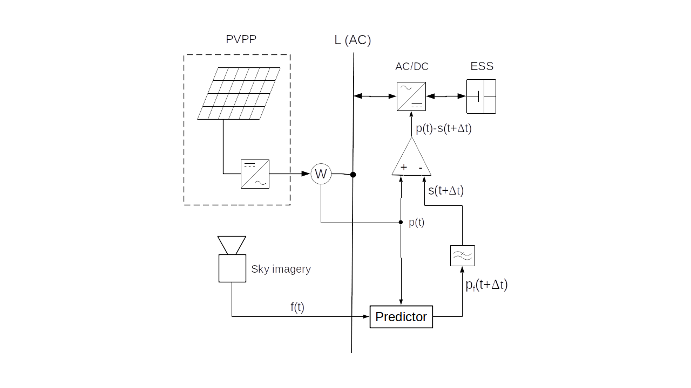
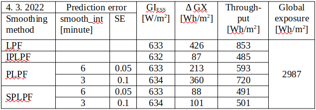

#Smoothing of PV power intermittency
Energy balancing between the grid and the battery may eliminate the PV intermittency almost loss-free. The objective of a loss-free smoothing is to meet the maximum ramping limits of PV power (allowed by a relevant technical standard) while accumulating the minimum possible energy by the filter. If the smooth PV power is generated by a low-pass filter (LPF) excited by the electrical output of PV panels, such a power filter induces high accumulation costs due to its time lag (group delay in its frequency response). The time lag could be eliminated, if LPF was excited by the future PV power signal. Unfortunately, the short-time PV prediction (nowcasting) is not exact and its error dramatically increases the accumulated energy by the LPF. Recently, various 
[predictive filters](https://www.sciencedirect.com/science/article/abs/pii/S1364032119304459)
 (e.g. 
[zero group-delay filter](https://www.planetanalog.com/five-things-to-know-about-prediction-and-negative-delay-filters/)
, [Kalman filter](https://www.kalmanfilter.net/default.aspx)
, moving average, moving median, etc.) have been developed to avoid the accumulation of PV energy due to the LPF time lag and the nowcasting error. Nevertheless, the accumulation of PV power and its cost induced by the predictive filters still exceed the production cost of e.g. nuclear electricity. The advantage of predictive filters is that they integrate the predictor and LPF into a same entity, but their disadvantage is that the predictor is trained by a limited information carried by the signal GI(t).  
We focus our analysis on the application of a 
[standard LPF](https://www.analog.com/en/design-center/glossary/low-pass-filter.html)
 excited by a 
[PV predictor](https://www.sciencedirect.com/science/article/abs/pii/S0038092X14001327)
  trained by the sky imagery and GI(t) signals:

<figure markdown>
  { width="650"}
  <figcaption>Figure 1: Smoothing of PV power by a low-pass filter</figcaption>
</figure>

In the schematic diagram on Figure 1, PV power plant (PVPP) is connected to the grid and its intermittent PV power p(t) is accumulated or compensated (i.e. smoothed) by the accumulator (BESS). The smoothing power is actuated by a bi-directional inverter AC/DC. It is determined by the ouput signal p(t)-s(t+Δt) of a differencer. Positive sign of the smoothing power is oriented from the grid to BESS. Hence the total power superimposed to the grid by PVPP and BESS is determined by the filter’s output signal s(t+Δt). For the simplification, PVPP and BESS are single-phase-connected to the grid. We will further consider 4 different smoothing methods:

- In case of **LPF** smoothing, the measured signal p(t) would bypass the predictor, directly exciting LPF.

- In theory, ideal predictive smoothing **IPLPF** would excite LPF by the exact future PV power signal p(t+Δt) where the time advance Δt is absolutely equal to the LPF's group delay at frequencies f<<fc, and fc is the cut-off frequency of LPF. The smooth power signal s(t+Δt) would be the response of LPF to the input signal p(t+Δt).

- According to the schematic diagram, **PLPF** smoothing method excites LPF by a predicted PV power signal pf(t+Δt). Its predictor is trained by the sky-imagery signal and by the measured PV power p(t).

- Eventually, a smart smoothing method **SPLPF** (patent pending) has been designed, integrating the filter with the PV predictor which is trained by the sky-imagery signal and by the measured PV power p(t). This method uses a modified scheme.

## Accumulation of energy by smoothing
For simplicity of analysis, the energy losses in AC/DC conversion and accumulation are neglected.  
Time course of the accumulated energy by ESS:

$$SOC(t)=\int_{0}^t (p(\tau)-s(\tau+\Delta t))d\tau\ \ \ \ \ \ \ \ \ (1)$$

defines the change of its state-of-charge [Wh] since time=0 until time=t, while SOC may acquire both positive and negative values. (Always-positive SOC values can be technically managed in ESS.) The time advance Δt reduces absolute values of the integrated function. The above-defined time advance Δt ensures that following technical criteria are satisfied:  
Mean value of SOC is near to zero: $${1 \over T} \int_{0}^T SOC (t) dt ≈ 0\ \ \ \ \ \ \ \ \ (2)$$

Mean quadratic deviation of SOC is near to minimum: $${1 \over T} \int_{0}^T SOC^2 (t) dt ≈ min\ \ \ \ \ \ \ \ \ (3)$$

Hence near-to-minimum required accumulaton capacity per cycle: $$\Delta SOC = max(SOC) – min(SOC) ≈ min\ \ \ \ \ \ \ \ \ (4)$$

The value ΔSOC should be predicted and ESS must be charged to ΔSOC/2 at the begining of each cycle T (24 hours in case of PV energy) in order to always keep SOC≥0.  
Eventually, near-to-minimum throughput of accumulated energy per cycle is achieved by Δt: $${1 \over 2} \int_{0}^T|p(\tau)-s(\tau+\Delta t)|d \tau ≈ min\ \ \ \ \ \ \ \ \ (5)$$

The rate of accumulation is expressed by (4) and (5) which are minimized by Δt during a working cycle T. The rate of accumulation is also expressed by the extreme ESS power demand p(τ)-s(τ+Δt) during a sudden loss or peak of direct sunlight. This value results from the installed power of PVPP.

Let us assume that PV power is proportional to the global solar irradiance GI [W/m2]. In our experiment, the solar irradiance is intercepted by a planar panel 20 cm x 16 cm on the earth’s surface at latitude=48.2°N, longitude=17.1°E, with the plane of incidence elevated by 47°, south-oriented. At this point it should be mentioned that the spectrum of a real PV power is smoother than the spectrum of GI(t), as the surface area of PV plane acts like a moving-average filter. Unfortunately, the size and speed of clouds prevents a true smoothing effect from being achieved. By assuming the proportionality between the PV power p(t) and the global irradiance GI(t), we analyze the worst case of solar intermittency. Let us substitute the signals p(τ), s(τ+Δt) in (1) by the measured signal GI(τ) and by its “predicted-and-smoothed” counterpart GIs(τ+Δt). After substituting, the expression (1) computes the time course of specific accumulated energy GX(t) [Wh/m2] by the filter.

## Ideal smoothing (IPLPF)
We simulate the operation of ideal predictive PV smoothing (IPLPF) by means of LPF excited by the exact future signal GI(t+Δt) where GI(t) is measured and the time advance Δt (given by the LPF group delay) eliminates the filter’s time lag. In theory, such a "ex post" simulated smoothing would minimize the accumulation of energy by the filter. This analysis aims to reveal the theoretical potential and affordability of PV smoothing. The numeric experiment is based on the measured solar irradiance over a period of 1 year, assuming contemporary prices of Lithium-Ion accumulators and EDLC supercapacitors.  
The measured time series GI(t) eventually allows to calculate the specific accumulator’s capacity [Wh/m2], its specific power [W/m2], specific energy throughput [Wh/m2/day], [Wh/m2/year] requested by the IPLPF smoothing. Based on the accumulators’ specifications and prices in 2021, the corresponding accumulation costs have been calculated. This confirmed that the IPLPF operation is definitely worthwhile with the German power purchase tariff and PV feed-in tariff in 2021. The ideal smoothing costs are substantially lower than the difference between purchase tariff and PV feed-in tariff. (We may assume that the smooth PV infeed partially compensates for the distribution costs.) 
The simulation suggests an affordable smoothing model for a hybrid small-scale PV plant, and suggests the accumulation technology for large-scale PV plants.  
### Smoothing by IPLPF vs LPF  
Global irradiance GI measured (legend meas), filtered by LPF (legend lp) and by IPLPF (legend aavg0), and specific accumulated energy GX:  
{: style="width: 49%; align='left';"}
{: style="width: 49%; align='right';"}

The left graph shows the measured and low-passed (legend “lp”) GI signals on a day with high solar exposure and strong intermittency. The graph on the right shows the specific accumulated energy GX [Wh/m2] by IPLPF vs. LPF on the same day. The time course of GX is proportional to the battery's state of charge SOC [Wh]. Exactly-predicted input signal shifts the IPLPF output to the left (legend “aavg0”), minimizing the standard deviation of SOC, thus in practise minimizing the difference ΔSOC = max(SOC) – min(SOC) which is the requested accumulation capacity. The throughput of accumulated energy (other than ΔSOC) is also minimized by IPLPF.

### Costs of IPLPF smoothing
The smoothing costs result from the energy accumulation. Accumulation costs are given by the rate of accumulation and the technology (e.g. Lithium-Ion RedOx, EDLC supercapacitor etc.). In theory, the accumulation rate is given by the intermittency of solar irradiance vs. desired time course of the output PV power. The accumulation rate is quantified by:

1. mandated ESS capacity, i.e. ΔSOC [Wh] reserved for smoothing (4)
2. total accumulated energy throughput [Wh] by smoothing (5)
3. maximum power [W] to/from ESS, balancing the intermittent PV power

In practice, the values 1. and 2. are larger the more imperfectly the balancing power between the grid and the battery is controlled. In the illustrated example, IPLPF needs only 24% ΔSOC relative to LPF, and IPLPF accumulates about 50% of the energy throughput if compared to LPF. Both ΔSOC and energy throughput reach their theoretical minimum by means of IPLPF smoothing.  
The higher LPF order or its lower cut-off frequency, the smoother output, but "earlier" input signal needed to eliminate the filter's time lag. (In case of PLPF smoothing: The greater Δt, the greater prediction error and the greater rate of accumulation.)  
The IPLPF simulation has confirmed that a hybrid PV system i.e. a small-scale on-grid PV plant having its own BESS with capacity = 2 hours x Ppvmax, need <10% of the BESS capacity to be reserved for smoothing (7% on 2022-03-04), while the rest BESS capacity is used for the energy storage. The hybrid PV plant feeds its “overflow” power into the grid, as long as the household’s consumption is satisfied and the battery has been charged. ***Having the reserved free capacity and total battery power available, the IPLPF costs are reasonably lower than the expected added value to the smooth PV power infeed.***  

IPLPF costs measured from 04/2021 to 03/2022. The plane of incidence and the LPF applied are the same as in the GI(t) and GX(t) plots:  
<figure markdown>
  { width="650"}
  <figcaption>Table 1</figcaption>
</figure>

#### Conditions of cost calculation:  
CapEx of "Hybrid with BESS” system include 90% of the BESS capacity reserved for storage, 10% for smoothing.  
1/3 of the generated PV energy is assumed as infeed to the grid (overflow) by a "Hybrid with BESS” on-grid system.  
Li-Ion & supercapacitor (SC): [life cycle parameters and prices](https://batteryuniversity.com/article/bu-209-how-does-a-supercapacitor-work) are as of 2021.  
Hybrid supercapacitor (HSC): price has been estimated upon relation between Li-Ion and SC prices.

The costs are specific per 1 kW of installed PV power. Installed PV power = DC output power of PV plant (before DC/AC conversion) assuming its solar incidence 1kW/m2 (1 Sun).  
CapEx = initial investment to PV smoothing. OpEx = regular (e.g. yearly) costs necessary for its uninterrupted operation. The greater from (CapEx, interval * OpEx) defines the cost of PV smoothing for a given service interval. However, when the smoothing uses >1 accumulation technologies concurrently, the service interval has to be fixed before calculating OpEx. (Reason: Given the service interval, two technologies with different wear-outs can be optimally mixed.) Hybrid systems and sole PV plants use different cost models, because the sole PV plant uses a mixed accumulation technology for smoothing. Energy losses due to the AC/DC conversion and accumulation were neglected.

### Applications of IPLPF
#### Small-scale hybrid PV system
A household with installed PV power <10kW is connected to the low-voltage grid, having a BESS with energy capacity ≈ 2h x installed PV power. After charging the BESS to a threshold SOC (e.g. 88%), the BESS provides enough power to smooth the PV infeed (overflowing PV power) to the grid for affordable costs, provided that the remaining free BESS capacity is left for smoothing, and additional technical measures avoid the microcycling of BESS. The power intermittency of small scale PV plants has no impact on the grid, unless their concentration in the grid is high. ***IPLPF technology offers an affordable smoothing of PV power in the grid areas with high concentration of small-scale hybrid PV systems.***

#### Suitable accumulators for IPLPF
The measured signal GI(t) determines the specific accumulation parameters maximum specific power max|GI(τ)-GIs(τ+Δt)| [W/m2] and maximum specific energy ΔGX=max(GX)-min(GX) [Wh/m2] required for the smoothing by IPLPF method. Although IPLPF shrinks the necessary ΔGX hence ΔSOC and the total accumulated throughput to their theoretical minimum, it reciprocally increases the relative smoothing power (Pmax x 1h)/ΔSOC up to 10C, since no algorithm can supply the missing PV power while the direct Sun beams are temporarily obscured by clouds. The lithium accumulators are cheap, efficient and fast, but not enough powerful for a sole IPLPF smoothing. It is not recommended to charge/draw a Li-Ion battery by a relative power >> 1, otherwise the battery’s life cycle would be curtailed. Such a high relative power is provided by EDLC supercapacitors (SC), but on contrary to Lithium bateries, these do not provide enough cheap capacity to make the IPLPF smoothing affordable. The currently-available electricity accumulation technology does not harmonize with demands of the sole IPLPF smoothing.  
Actually, the IPLPF demands are well satisfied by a 
[flywheel (FESS)](https://energystorage.org/why-energy-storage/technologies/flywheel-energy-storage-systems-fess/)
: 1) Its max(SOC) poses no limit to max(P) within demands of IPLPF smoothing. 2) IPLPF accumulates energy only on solar-intermittent days (else no accumulation is needed), and the flywheels only wear out when they are rotating - mainly those with mechanical bearings. Because of unknown prices and life cycle parameters, we calculated neither CapExp, nor OpExp of the flywheel in a role of IPLPF accumulator. However, ***the native synergy between demands and features identifies the flywheel as a suitable accumulator for IPLPF smoothing.***

#### Large-scale PV plant
Water pumps provide efficient storage for large scale PV plants (cheaper and cleaner than corresponding BESS), but no power smoothing because the water pumps are too sluggish for such a role. Large-scale PV intermittency can be smoothed by a relatively low accumulation capacity =ΔSOC and a large relative power up to 10C. Such technical demands are better met by flywheels than by RedOx or EDLC technology.
Because of missing FESS prices and wear-out data, we have cost-optimized the IPLPF smoothing for a large-scale PV plant by mixing 2 technologies: SC and HSC concurrently operating during 15 years of service. The future HSC technology is already being developed: 
[hybrid supercapacitor](https://www.sciencedirect.com/science/article/abs/pii/S1364032118307299)
, combining advantages of EDLC & RedOx technologies.

### Summary of IPLPF
One year of the continous GI(t) measurement has confirmed that ideal PV smoothing can be affordable with the current Lithium-Ion technology - if properly implemented in a hybrid PV system (incl. measures against micro-cycling of a battery). Although the HSC technology is yet unavailable, the intensive seek for energy makes it very likely to be soon mature for large-scale installations. Flywheel can be an affordable energy storage in the IPLPF smoothing of PV power. ***Low accumulated energy by the IPLPF smoothing should motivate the further development of technologies among which accurate nowcasting of PV power and smart filtering of PV power are crucial.***
  
## Real smoothing of PV power
The measured global irradiance signal GI(t) allows not only the simulation of ideal predictive low-pass smoothing (IPLPF), but also the predictive smoothing of PV power (PLPF), exciting a low-pass filter (LPF) by a simulated predicted signal GIf(t+Δt). The values GIf are biased by a prediction error. As we show below, this error induces a significant accumulation of energy by PLPF when compared with IPLPF. We simulated the prediction error to the measured GI values in order to statistically represent the real predicted signal GIf(t+Δt). Based on the measured signal GI(t), the "ex-post" simulation of PLPF allowed us to empirically analyze its smoothing performance and energy accumulation.  
In addition to PLPF, we have developed a “smart predictive" low-pass smoothing method (patent pending SPLPF), minimizing the accumulated energy with respect to the real-predicted values GIf exciting the LPF. Finally, we analyzed the performance of four different PV smoothing methods:

1. LPF: Input of LPF is excited by the measured signal GI(t)
2. IPLPF: Input of LPF is excited by the measured, optimally left-shifted signal GI(t+Δt)
3. PLPF: Input of LPF is excited by the simulated-predicted signal GIf(t+Δt)
4. SPLPF: Power filter is excited by the simulated-predicted signal GIf.

### Simulation of predicted PV power
We simulated the predicted signal GIf(t+Δt) from the measured, left-shifted GI signal by interval Δt, by smoothing its "future" time course and by superimposing a random error to its "future" value with respect to the fundamental properties of PV predictors:

- as the advance Δt increases, the (unwanted) smoothing of the predicted signal GIf strengthens
- as the advance Δt increases, the impact of  random error on GIf increases (statistically cumulates)

Both errors are applied at the "future" time t+Δt whereas Δt is given by the demanded smoothing quality. Δt matches with the group delay which is controlled by the order and cut-off frequency of LPF. In the simulation, we trim the prediction error by 2 quantitative (OLAP) dimensions:

- Interval of prediction, after passing of which the smoothing impact on the predicted signal is strengthened, is defined by the parameter smooth_int [minute]. The shorter this interval, the steeper the smoothing effect rises towards predicted future.
- Standard deviation of the random prediction error (dimensionless parameter SE). A random value is superimposed to future GI values. This is re-generated each time after passing a 6-minute interval of prediction. Hence the impact of random error on GIf(t+Δt) statistically cumulates over the prediction time.

GI predictors with two different accuracies have been simulated:

- “Better prediction accuracy”: smooth_int = 6 minutes, SE = 0.05
- "Worse prediction accuracy": smooth_int = 3 minutets, SE = 0.1.

For each method, the smoothing quality and the rate of accumulation were analyzed by means of LPF orders 1 to 4. Filters of different orders are tuned to generate equivalent smoothing effects, provided that the filters of different orders are excited by the measured, optimally shifted input signal (like in IPLPF case). When this tuning rule is followed, increasing the order of the LPF increases its cutoff frequency, while the optimal advance Δt increases only slightly.  
Smoothing of PV power during a day with strong solar intermittency was analyzed by the four above-listed smoothing methods:
The results of analysis have been tabelized and plotted. The impact of prediction error (see Figure 2, Figure 6) exhibits the following empiric dependencies of the tracking criteria along the OLAP partial dimensions:

### Smoothing quality by prediction error

#### Smoothed predicted signal

- Changing the value of smooth_int affects the power smoothing quality neither by SPLPF nor by PLPF method, while for all parameter values, the SPLPF method provides worse smoothing than the PLPF method (Figure 3, Figure 4, Figure 7, Figure 8).
- Lowering the value of smooth_int dramatically increases the accumulation rate by the PLPF method, which is always much greater than the accumulation rate by SPLPF method (Figure 5, Figure 9). With the worse prediction accuracy, the PLPF method even exceeds the accumulation rate induced by the LPF method (Figure 9). In the SPLPF method, the accumulation rate increases only slightly and much more slowly than in the PLPF method.

#### Random error in predicted values

- Increasing of SE parameter does not degrade the smoothing quality by the PLPF method, but it does degrade the smoothing by the SPLPF method (check Figure 7 vs Figure 8), in which the smoothing performance with standard error SE > 0 is always worse than in the PLPF method.
- Increasing the value of SE parameter significantly increases the accumulation rate by the PLPF method (Figure 5, Figure 9), which is for all values SE > 0 much higher than by the SPLPF method. For some SE values, the PLPF method even exceeds the LPF method in its accumulation rate. The accumulation rate increases only slightly in the SPLPF method, and less so the higher the filter order.

### Smoothing quality by LPF order
Filter order is the third OLAP dimension, impact of which was analyzed together with the prediction error. We analyzed the LPF orders 1 to 4 (figures 10 to 21):

- Filter order does not affect the smoothing quality of PLPF method and for small filter orders, the smoothing quality of PLPF is better than that of SPLPF.
- Increasing the filter order from 1 to 3 significantly improves the quality of SPLPF smoothing, given simulated prediction error (Figures 10-13, 16-18).
- Increasing the filter order only slightly reduces the accumulation rate by PLPF smoothing. The accumulation rate by PLPF is always substantially larger than by SPLPF.
- Increasing the filter order from 1 to 3 significantly reduces the accumulation rate by SPLPF smoothing, given simulated prediction error (Figures 13-15, 19-21). ***By means of optimal filter order with a relatively small prediction error, SPLPF shrinks the accumulation rate close to the IPLPF method.***

## Summary
The signal GI(t) is plotted as measured, predicted, and smoothed by the four different smoothing methods. Finally, a daily time course of the specific accumulated energy GX [Wh/m2] is displayed, corresponding to the smoothing method. Performance of the 3rd-order low-pass filter is shown by the graphs. Two days with strong solar intermittency have been selected for the simulation: a day with medium solar exposure 3.0 kWh/m2, and a day with high solar exposure 5.9 kWh/m2 (measured at the above-specified plane of incidence). Time advance Δt = 30 minutes was applied in order to achieve a desired smoothing effect on both selected days. Accumulation rate by the four different smoothing methods has benn aggregated, based on the measured GI(t) signal. The results are summarized in Table 2 and Table 3: In the column "ΔGX", a difference between the maximum and minimum specific accumulated energy is calculated by the expression (4). In the column "Throughput", a total daily flow of the specific energy through the accumulator is calculated by (5). For a comparison, the daily specific global exposure at the plane of incidence is  displayed too.

### Accumulated energy by smoothing
<figure markdown>
  { width="650"}
  <figcaption>Table 2</figcaption>
</figure>
.  
<figure markdown>
  { width="650"}
  <figcaption>Table 3</figcaption>
</figure>

With "better GI prediction accuracy", the SPLPF smoothing required 21% - 22% of the BESS energy capacity (Δ GX) used by the LPF method during the selected days, or 24% - 41% of the capacity used by the PLPF method. SPLPF eventually required 1.0 - 1.2 times the energy capacity used by the IPLPF method. The SPLPF smoothing put 58% - 73% of the energy flow through the accumulator relative to the LPF method, or 75% - 83% of the energy throughput by the PLPF method. SPLPF eventually put 1.0 - 1.1 times more energy through BESS than the IPLPF method.

With "worse GI prediction accuracy", the SPLPF smoothing required 24% - 33% of the BESS energy capacity (Δ GX) used by the LPF method during the selected days, or 19% - 28% of the capacity used by the PLPF method. SPLPF eventually required 1.2 - 1.8 times the energy capacity used by the IPLPF method. The SPLPF method put 59% - 77% of the daily energy flow through the accumulator relative to the LPF method, or 63% - 69% of the energy throughput by the PLPF method. SPLPF eventually put 1.0 - 1.1 times more  energy through BESS than the IPLPF method.

Although we haven't analyzed the whole year (simulation of GIf is computationally intensive), the analysis of 4 smoothing methods based on 2 days with high solar intermittency, different solar exposures and various prediction error gave us a real assumption that SPLPF performs much better than PLPF, and that ***SPLPF performs close to the ideal smoothing IPLPF with the appropriate filter order and provided that the prediction error is not too high.*** These empiric results have been also theoretically justified.

## Graphical display of smoothing
Plotted are the measured time-courses of 2 days, both exhibiting the strong solar intermittency. For illustration, various time courses have been plotted to express the smoothing quality by various criteria:

- Measured GI(t), synchronized with predicted GIf (1 hour zoomed from the daily time course)
- Measured GI(t) and its smooth equivalent by the prediction accuracy and smoothing method, applying optimal LPF order
- Accumulated GX(t) by the prediction accuracy and smoothing method, applying optimal LPF order
- Smoothed GI(t) by the filter order and prediction accuracy, using the IPLPF and SPLPF smoothing methods
- Accumulated GX by the filter order and prediction accuracy, using the IPLPF and SPLPF smoothing methods

###  Smoothing quality by prediction error

####  Day with medium insolation

<figure markdown>
  { width="650"}
  <figcaption>Figure 2: Measured GI synchronized with GIf (predicted 30 minutes ago) between 11:00 and 12:00. (Lo Err: better prediction accuracy, Hi Err: worse prediction accuracy)</figcaption>
</figure>

<figure markdown>
  { width="650"}
  <figcaption>Figure 3: Measured and smoothed GI by 4 different methods; better prediction accuracy</figcaption>
</figure>

<figure markdown>
  { width="650"}
  <figcaption>Figure 4: Measured and smoothed GI by 4 smoothing methods; worse prediction accuracy</figcaption>
</figure>

<figure markdown>
  { width="650"}
  <figcaption>Figure 5: Time course of GX accumulated by 4 smoothing methods. (Lo Err: better prediction accuracy, Hi Err: worse prediction accuracy)</figcaption>
</figure>
  
#### Day with high insolation

<figure markdown>
  { width="650"}
  <figcaption>Figure 6: Measured GI synchronized with GIf (predicted 30 minutes ago) between 11:00 and 12:00. (Lo Err: better prediction accuracy, Hi Err: worse prediction accuracy)</figcaption>
</figure>

<figure markdown>
  { width="650"}
  <figcaption>Figure 7: Measured and smoothed GI by 4 smoothing methods; better prediction accuracy</figcaption>
</figure>

<figure markdown>
  { width="650"}
  <figcaption>Figure 8: Measured and smoothed GI by 4 smoothing methods; worse prediction accuracy</figcaption>
</figure>

<figure markdown>
  { width="650"}
  <figcaption>Figure 9: Time course of GX accumulated by 4 smoothing methods. (Lo Err: better prediction accuracy, Hi Err: worse prediction accuracy)</figcaption>
</figure>
  
### Smoothing quality by LPF order

#### Day with medium insolation

<figure markdown>
  { width="650"}
  <figcaption>Figure 10: Time course of IPLPF-smoothed GI by filter order</figcaption>
</figure>
  
<figure markdown>
  { width="650"}
  <figcaption>Figure 11: Time course of SPLPF-smoothed GI by filter order; better prediction accuracy</figcaption>
</figure>
  
<figure markdown>
  { width="650"}
  <figcaption>Figure 12: Time course of SPLPF-smoothed GI by filter order; worse prediction accuracy</figcaption>
</figure>
  
<figure markdown>
  { width="650"}
  <figcaption>Figure 13: Time course of IPLPF-smoothed GX by filter order</figcaption>
</figure>
  
<figure markdown>
  { width="650"}
  <figcaption>Figure 14: Time course of SPLPF-smoothed GX by filter order; better prediction accuracy</figcaption>
</figure>
  
<figure markdown>
  { width="650"}
  <figcaption>Figure 15: Time course of SPLPF-smoothed GX by filter order; worse prediction accuracy</figcaption>
</figure>
.  

#### Day with high insolation

<figure markdown>
  { width="650"}
  <figcaption>Figure 16: Time course of IPLPF-smoothed GI by filter order</figcaption>
</figure>
  
<figure markdown>
  { width="650"}
  <figcaption>Figure 17: Time course of SPLPF-smoothed GI by filter order; better prediction accuracy</figcaption>
</figure>
  
<figure markdown>
  { width="650"}
  <figcaption>Figure 18: Time course of SPLPF-smoothed GI by filter order; worse prediction accuracy</figcaption>
</figure>
  
<figure markdown>
  { width="650"}
  <figcaption>Figure 19 Time course of GX by filter order; IPLPF smoothing)</figcaption>
</figure>
  
<figure markdown>
  { width="650"}
  <figcaption>Figure 20: Time course of GX by filter order; SPLPF smoothing with better prediction accuracy</figcaption>
</figure>
  
<figure markdown>
  { width="650"}
  <figcaption>Figure 21: Time course of GX by filter order; SPLPF smoothing with worse prediction accuracy</figcaption>
</figure>

