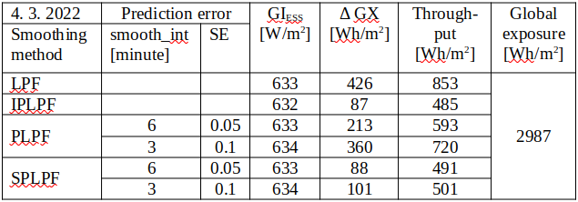
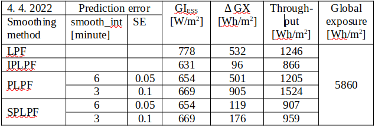

## Real PV smoothing (PLPF, SPLPF)
Trade-off between the smoothing effect and the accumulation rate is especially critical in the PLPF smoothing: The higher Δt, the higher prediction error, and the much higher accumulation rate.  
Now, the objective is to analyze the smoothing effect vs. accumulation rate (in summary: effectivity) of PV smoothing under real conditions. The measured global irradiance signal GI(t) allows not only the numeric modelling of the ideal predictive low-pass smoothing (IPLPF), but also a simulation of the predictive smoothing (PLPF) having its LPF excited by a nowcasted signal GI~f~(t+Δt). The values GI~f~ are distorted by a prediction error. The numeric results will show that this error induces a significant energy accumulation by the PLPF smoothing. We simulated the prediction error into the measured GI values, statistically representing the predicted signal GI~f~(t+Δt) with a possibility of varying the prediction error. This allowed us to analyze the impact of prediction error on the PV power smoothing - its quality and the rate of accumulation.  
In addition to the PLPF, we have developed a “smart predictive" low-pass filtering method [SPLPF](https://mhrons.github.io/splpf/), minimizing the accumulated energy [(4)](https://mhrons.github.io/pv_smooth/#energy-accumulated-by-smoothing), [(5)](https://mhrons.github.io/pv_smooth/#energy-accumulated-by-smoothing) with respect to the real-predicted values GI~f~ and the given ramping limit. We eventually analyzed the performance of the following smoothing methods:

1. LPF: Input of LPF excited by the measured signal GI(t)
2. IPLPF: Input of LPF excited by the exact future signal GI(t+Δt)
3. PLPF: Input of LPF excited by the simulated-predicted signal GI~f~(t+Δt)
4. SPLPF: Smart power filter excited by the simulated-predicted signal GI~f~.

## OLAP analysis
A multi-dimensional [OLAP cube](https://en.wikipedia.org/wiki/Online_analytical_processing) contains the pre-aggregated specific rates of accumulation along partial dimensions (a few of independent quantitative or categorical variables), provided that a constant smoothing effect meets the given power ramping limit along all dimensions. Let us define the reference smoothing as the output of a 3rd-order Butterworth filter with the cut-off frequency = 7.5/12h (Δt = 30 minutes). The OLAP cube consists of the following dimensions:

- smoothing method
- LPF order
- smooth_int (prediction error)
- SE (prediction error)

First of all, the constant smoothing effect has to be fixed for various LPF used: Low-pass filters of orders 1 to 4 are tuned to output equal power ramping, provided that each filter is excited by the measured, optimally shifted signal GI(t+Δt). With such a IPLPF tuning, increasing of the LPF order increases its cut-off frequency but only slightly increases its time lag Δt. The next goal is to identify the LPF order which accumulates a minimum of energy, given ramping limit, smoothing method, and prediction error. Same optimal LPF order was identified for the SPLPF as well as for the IPLPF smoothing method. (This is irrelevant for the remaining 2 methods as they accumulate much more energy than both IPLPF and SPLPF do.) After determining the optimal LPF order, the performance of smoothing methods PLPF and SPLPF was analyzed by a variable prediction error. The numerical results are displayed in tables and graphs, and are explained in text.

### Simulation of predicted PV power
The impact of prediction error on GI~f~ values is observed at the "future" time t+Δt. The predicted signal GI~f~(t+Δt) is derived from the measured, left-shifted signal GI(t+Δt) by superimposing a random error to its "future" time course and then by smoothing it with respect to the fundamental properties of PV predictors:

- as the advance Δt increases, the impact of random error on GI~f~ statistically cumulates (increases)
- as the advance Δt increases, the (unwanted) smoothing of the predicted signal GI~f~ strengthens

We specify the prediction error by 2 OLAP dimensions:

- Interval of prediction, after passing of which the smoothing effect in the predicted signal is strengthened, is defined by the parameter **smooth_int** [minute]. The shorter this interval, the steeper the smoothing effect rises towards predicted future.
- Standard deviation of the random error **SE** (a dimensionless parameter). A normally distributed random value is superimposed to all "future" GI values. This error is re-generated after passing each 6-minute interval of prediction, and is repeatedly superimposed to all remaining future values. The impact of random error on GI~f~(t+Δt) is statistically cumulated over interval Δt (obviously greater than 6 minutes).

In this report, we simulate the GI~f~ predictors with two different accuracies:

- “Better prediction accuracy”: smooth_int = 6 minutes, SE = 0.05
- "Worse prediction accuracy": smooth_int = 3 minutets, SE = 0.1.

### Impact of prediction error

Quality and accumulation rate of the power smoothing exhibit following dependencies on partial dimensions expressing the prediction error (e.g. [Figures 5, 6 and 7](https://mhrons.github.io/pv_graph/#a-day-with-medium-insolation)):

**Smoothed predicted signal**  

- Changing smooth_int affects the smoothing effect neither of SPLPF nor PLPF method, while for all applied values, PLPF performs smoother than SPLPF (e.g. [Figures 5, 6](https://mhrons.github.io/pv_graph/#a-day-with-medium-insolation)).
- Lowering smooth_int dramatically increases the accumulation rate of PLPF, which is always much greater than the accumulation rate of SPLPF (e.g. [Figure 7](https://mhrons.github.io/pv_graph/#a-day-with-medium-insolation)). With "worse prediction accuracy", the PLPF method even exceeds the accumulation rate induced by the LPF method (e.g. [Figure 7](https://mhrons.github.io/pv_graph/#a-day-with-medium-insolation)). In SPLPF, the accumulation rate increases only slightly and much more slowly than in PLPF.

**Random error in predicted values**  

- Increasing SE has no impact on the smoothing effect of PLPF, but it damages the smoothing of SPLPF (e.g. [Figure 9 vs Figure 10](https://mhrons.github.io/pv_graph/#a-day-with-high-insolation)). In PLPF, the smoothing effect with SE > 0 is always better than in SPLPF.
- Increasing SE significantly increases the accumulation rate of PLPF ([Figures 7, 11](https://mhrons.github.io/pv_graph/#a-day-with-medium-insolation)), which is for all SE > 0 much higher than the accumulation rate of SPLPF. For some SE values, the PLPF method even exceeds the LPF method in its accumulation rate. The accumulation rate increases only slightly with SPLPF, and less so the higher the filter order (tested for order≤3).

### Analysis by LPF order
The filter order is another OLAP dimension, the impact of which on the smoothing performance was analyzed along with the prediction error. We analyzed the LPF orders 1 to 4 ([Figures 12-23](https://mhrons.github.io/pv_graph/#analysis-by-lpf-order)):

- Filter order does not affect the smoothing effect of PLPF method, given a non-zero prediction error. For small filter orders, the output of PLPF is smoother than that of SPLPF.
- Increasing the filter order from 1 to 3 notably improves the smoothing effect of SPLPF, given a non-zero prediction error ([Figures 12-14, 18-20](https://mhrons.github.io/pv_graph/#analysis-by-lpf-order)).
- Given the prediction error, increasing of the filter order only slightly reduces the accumulation rate of PLPF which is always substantially greater than the accumulation rate of SPLPF.
- Increasing of the filter order notably reduces the accumulation rate induced by both IPLPF (zero prediction error) and SPLPF (non-zero prediction error) smoothing methods - see [Figures 15-17, 21-23](https://mhrons.github.io/pv_graph/#analysis-by-lpf-order). With the simulated predictor, this trend is reversed between the orders 3 and 4 by the SPLPF method. ***With the simulated predictor, SPLPF performs best with the filter order 3.***

## Numerical results of PV smoothing

The presented results are based on the measured GI data from days exhibiting a strong solar intermittency and a moderate to high insolation. 

### Accumulation rate by method
**Specific accumulation rate per date and smoothing method, using the reference filter:**
<figure markdown>
  { width="650"}
  <figcaption>Table 2: Date 2022-03-04 medium insolation, strong intermittency</figcaption>
</figure>
  
<figure markdown>
  { width="650"}
  <figcaption>Table 3: Date 2022-04-04 high insolation, strong intermittency</figcaption>
</figure>

Maximum specific power from/to ESS calculated by [(6)](https://mhrons.github.io/pv_smooth/#energy-accumulated-by-smoothing) is in the column "GI~ESS~". A difference between the maximum and minimum specific accumulated energy calculated by [(4)](https://mhrons.github.io/pv_smooth/#energy-accumulated-by-smoothing) is in the column "ΔGX". Daily flow of the specific energy through ESS calculated by [(5)](https://mhrons.github.io/pv_smooth/#energy-accumulated-by-smoothing) is in the column "Throughput". Daily insolation at the plane of incidence is displayed as "Global exposure".

With "better prediction accuracy" during the selected days, the SPLPF smoothing required a relative ESS power between 5.5h^-1^ - 7.2h^-1^ which is 3.8 - 4.8 times more then by the LPF smoothing, 2.4 - 4.2 times more than by PLPF, and eventually 84% - 99% of the IPLPF power request. The SPLPF smoothing required 21% - 22% of the ESS capacity used by the LPF method, or 24% - 41% of the capacity used by PLPF. The SPLPF eventually required 1.0 - 1.2 times the ESS capacity used by IPLPF. The SPLPF smoothing put 58% - 73% of the energy through ESS relative to the LPF method, or 75% - 83% of the energy throughput by PLPF. SPLPF eventually put 1.0 - 1.1 times more energy through ESS than the IPLPF method.

With "worse prediction accuracy" during the selected days, the SPLPF smoothing required a relative ESS power between 3.8h^-1^ - 6.3h^-1^ which is 2.6 - 4.2 times more then by the LPF smoothing, 3.6 - 5.1 times more than by PLPF, and eventually 58% - 86% of the IPLPF power request. The SPLPF smoothing required 24% - 33% of the ESS capacity used by the LPF method, or 19% - 28% of the capacity used by PLPF. The SPLPF eventually required 1.2 - 1.8 times the ESS capacity used by IPLPF. The SPLPF smoothing put 59% - 77% of the energy through ESS relative to the LPF method, or 63% - 69% of the energy throughput by PLPF. SPLPF eventually put 1.0 - 1.1 times more energy through ESS than the IPLPF method.

### SPLPF vs IPLPF
Although we did not analyze the whole year (the numerical simulation of SPLPF is computationally intensive), our analysis of 4 smoothing methods on the selected days with high solar intermittency and various solar exposures, with 4 filter orders, and with a varying prediction error provided a detailed insight into the SPLPF performance. This smoothing method performs much better than the PLPF. ***With moderate prediction error, SPLPF performs close to the ideal smoothing IPLPF.*** The presented empirical results are theoretically proven in the chapter [SPLPF Smoothing](https://mhrons.github.io/splpf/).
