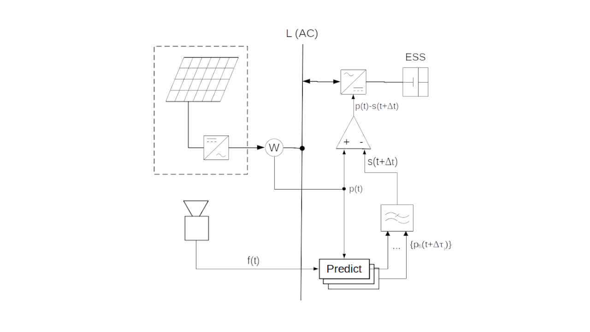

password: PV$Mplpf
If we were to smooth the renewable power by an analogue LPF implemented e. g. from elements of electrical inductance and capacity, then the excessive accumulated energy due to the filter's time lag Δt cannot be eliminated, unless its input is continuously driven by the future signal p~f~(t+Δt). Unlike the analogue LPF, its numerical model calculates a complete time series of the corresponding output signal s(t+Δt) immediately (if we neglect duration of its computation) at any time t, if the entire time series of input values p(τ) is available in the interval (0, t+Δt]. The numerical model of LPF can be given more precise input values from the near future, than these are predictable at the maximum advance Δt. Simultaneous excitation of the LPF model by multiple predictors (that is, by a multi-predictor) with advance intervals between 0 and Δt can improve the accuracy of the aggregated signal s(t+Δt). This is reflected by the smaller accumulation rate (closer to its theoretical minimum) in contrast to the analogue LPF driven by a single input signal advancing by Δt, predicted by the equivalent technology.  
Assuming that LPF is a linear, time-invariant system, the advantage of exciting the LPF model by the multi-predictor will be proven by means of the principle of superposition: Let us calculate the LPF response to the input signal p(t+Δt) as a convolution of the filter’s impulse response and its input signal:  
$$s(t+\Delta t)=h(t+\Delta t)*p(t+\Delta t)=\int_{0}^{t+\Delta t} h(\tau)p(t+\Delta t-\tau)d\tau\tag{1}\label{eq:1}$$
For the current time t holds: In the τ area where Δt-τ≤0 applies, the measured (past) values p are integrated, while in the τ area where Δt-τ>0 applies, the predicted (future) values p~f~ are integrated. The convolution \eqref{eq:1} integrates the input signal of the filter over infinitesimally small intervals dτ. Within each differential dτ, the future value p~f~ can be estimated by a specific predictor producing a minimized error with respect to its particular advance Δt-τ.
<figure markdown>
  { width="650"}
  <figcaption>Figure 1: Smoothing of PV power by LPF model excited by multipredictor</figcaption>
</figure>
In theory, the advantage of smoothing the random fluctuations in RES power by the numerical model of LPF excited by the multi-predictor results from a synergy of three fundamental properties: 

1. The lower advance Δt, the smaller prediction error in p~f~(t+Δt)
2. Convolution \eqref{eq:1} integrates a product of two timely-opposing signals
3. The ideal LPF's impulse response starts from value 0 and reaches its first extremum approximately at the time Δt.

The synergistic effect suppresses the prediction error in the filter's aggregated signal s(t+Δt) in the sense that, for the given RES intermittency and LPF, the numerical filter model excited by the multi-predictor exhibits much less accumulation rate than the same filter excited by a single predicted signal advancing by Δt does. This relative advantage is shown in [diagrams (Figure 7, 11)](https://mhrons.github.io/pv_smooth/#analysis-by-prediction-error) and exists regardless of the prediction technology applied.
